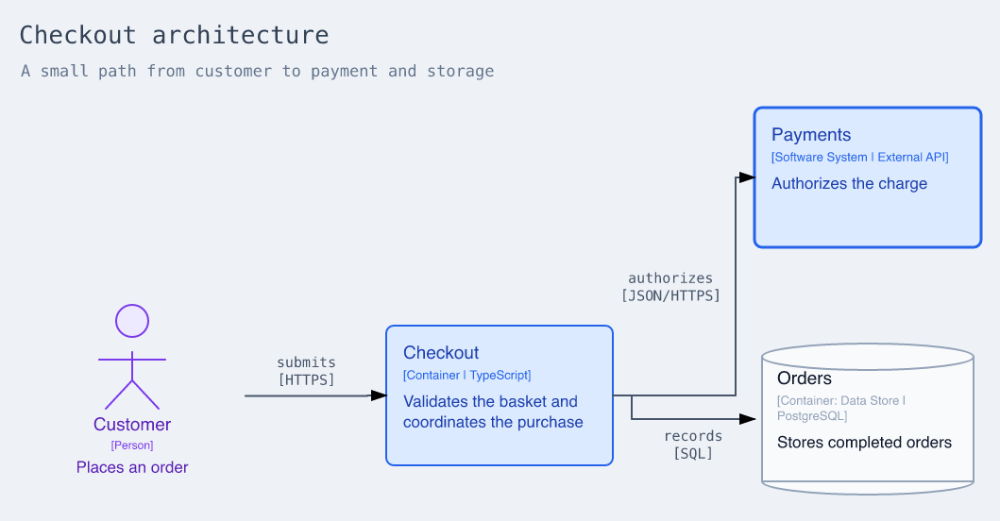
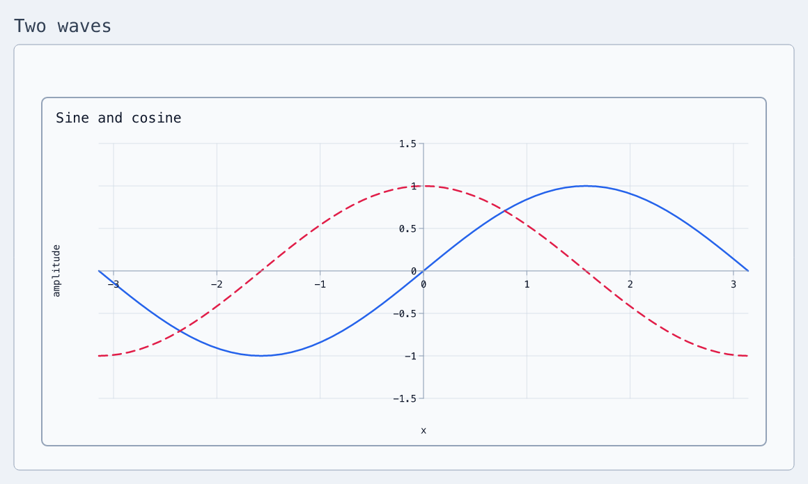
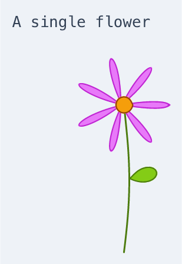

<p align="center">
  
</p>

<p align="center">
  Write diagrams as text. Keep editing them in Excalidraw.
</p>

<p align="center">
  <a href="#start-with-one-shape">Start</a> ·
  <a href="docs/language.md">Language</a> ·
  <a href="#four-small-examples">Examples</a> ·
  <a href="docs/tour.md">Tour</a> ·
  <a href="docs/spec.md">Specification</a>
</p>

XDraw turns a text file into native Excalidraw shapes, text, frames, and
connectors. The generated drawing remains editable; you can open it in
[Excalidraw](https://excalidraw.com), move things around, and continue by hand.

## Start with one shape

An XDraw file can be this small:

```xdraw
diagram "Hello" {
  message: rectangle "Hello, Excalidraw"
}
```

Save it as `hello.xdraw`, then build it:

```bash
xdraw build hello.xdraw
```

XDraw writes `hello.excalidraw` beside the source file. It can also render PNG
and SVG previews:

```bash
xdraw build hello.xdraw -o hello.png
xdraw build hello.xdraw -o hello.svg
```

### Install from the repository

XDraw requires Node.js 22.18 or newer.

```bash
git clone https://github.com/fractalops/xdraw.git
cd xdraw
npm install
npm link
```

## Let layout do the measuring

Give each element a name, then connect those names. An arrangement chooses the
positions and leaves room for the connector labels.

```xdraw
diagram "Request flow" {
  arrange grid { columns = 3; gap = 120 }

  browser: ellipse "Browser"
  api: rectangle "API"
  store: rectangle "Database"

  browser -> api "requests"
  api -> store "queries"
}
```

`browser`, `api`, and `store` are stable IDs. Their quoted text is what appears
in the drawing. Change a label and XDraw measures the new text before arranging
the diagram.

Structure uses the same nesting you see on the page:

```xdraw
diagram "A small system" {
  client: ellipse "Client"

  platform: frame "Platform" {
    arrange row { gap = 100 }

    api: rectangle "API"
    store: rectangle "Orders"
    api -> store "writes"
  }

  client -> platform.api "calls"
}
```

The frame owns `api` and `store`, so their full names are `platform.api` and
`platform.store`. No coordinates are needed.

## Four small examples

Each picture below is built from the linked XDraw file. The sources are short
and independent, so you can copy one without bringing along the others.

### Architecture

Architecture constructors add familiar people, systems, containers, and data
stores. The layered arrangement derives direction from the relationships.



[Source](examples/readme-architecture.xdraw) ·
`xdraw build examples/readme-architecture.xdraw`

### Plot on a coordinate plane

Plots inside `math.plane` share axes and a viewport. Here the `x` interval is
written once; XDraw infers the vertical interval from `sin(x)` and `cos(x)`.



[Source](examples/readme-plane.xdraw) ·
`xdraw build examples/readme-plane.xdraw`

### Mathematical formulas

Formula source is ordinary TeX. XDraw renders it as an embedded SVG and keeps
the authored TeX in the scene metadata.


[Source](examples/formulas.xdraw) · `xdraw build examples/formulas.xdraw`

### A small drawing

This flower uses four curves: a stem, a leaf, seven petals, and a circular
centre. The leaf and flower head attach to points along the sampled stem, so
moving or reshaping the stem keeps the drawing joined.

<p align="center">
  
</p>

[Source](examples/readme-flower.xdraw) ·
`xdraw build examples/readme-flower.xdraw`

## Explore when you need more

- [The language syntax](docs/language.md) is the compact reference for source
  structure, values, references, connections, layout, and reuse.
- [The language tour](docs/tour.md) introduces layouts, styles, templates,
  repetition, measured placement, mathematical plots, formulas, tables, code,
  images, and annotations.
- [`examples/`](examples/) contains complete sources you can build and modify.
- [The specification](docs/spec.md) defines the grammar and processing rules.
- [The architecture guide](docs/architecture.md) follows a document through
  parsing, validation, layout, and rendering.

## CLI

```text
xdraw build [<file>|-] [-o <output>]
xdraw check [<file>|-]
xdraw apply [<file>|-]
xdraw list [<collection>]
xdraw pull <address-or-id> [-o <output>]
```

`build` creates an editable scene or a PNG/SVG preview. `check` runs the same
compiler without writing a drawing and prints the resulting bounds, paths,
connector-label placement, container slack, constraints, and asset sizes. Its
default report is readable text; use `--format json` when another tool will
consume it. Both commands accept a file, standard input, or inline source with
`-e`.

`list`, `pull`, and `apply` work with hosted Excalidraw+ scenes and use the
`EXCALIDRAW_API_KEY` environment variable. See
[Hosted scenes](docs/tour.md#hosted-scenes) for addresses, replacement, and
targeted patches.

Run `xdraw --help` for the complete command reference.

## Development

```bash
npm run build
npm run typecheck
npm test
npm run test:browser
```

See [Architecture](docs/architecture.md) for the compiler structure and
[Releasing XDraw](docs/releasing.md) for the maintainer workflow.

XDraw uses [Excalidraw](https://github.com/excalidraw/excalidraw),
[ELK](https://github.com/kieler/elkjs),
[Shiki](https://github.com/shikijs/shiki),
[MathJax](https://www.mathjax.org/),
[Perfect Freehand](https://github.com/steveruizok/perfect-freehand), and
[resvg-js](https://github.com/yisibl/resvg-js). It is available under the
[MIT License](LICENSE).
