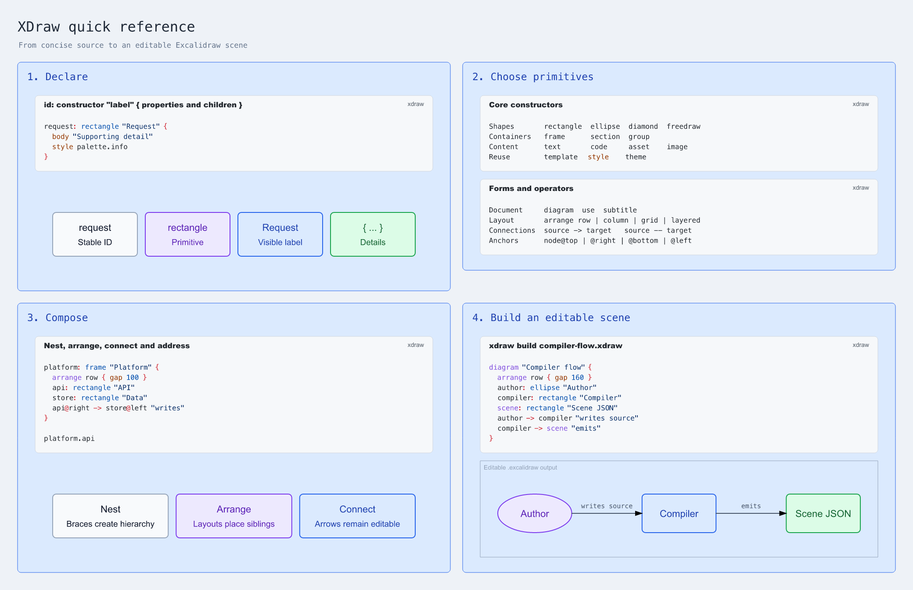
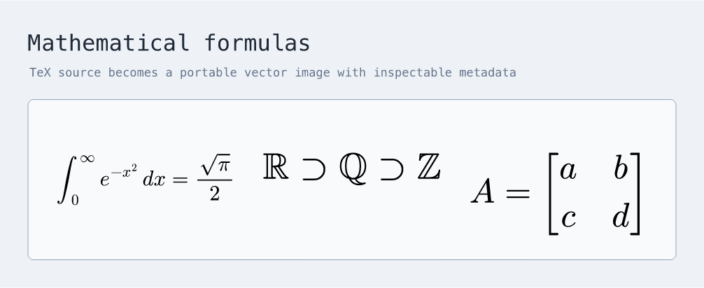
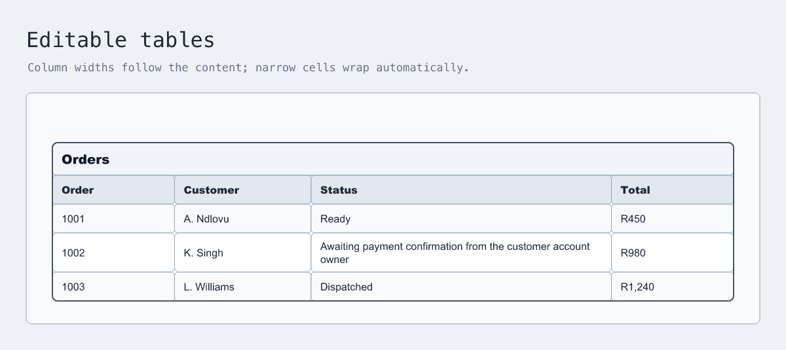

<p align="center">
  
</p>

<p align="center">
  Describe diagrams in text. Keep editing them in Excalidraw.
</p>

<p align="center">
  <a href="#quick-start">Quick start</a> ·
  <a href="#language">Language</a> ·
  <a href="#hosted-scenes">Hosted scenes</a> ·
  <a href="docs/language-reference.md">Guide</a> ·
  <a href="docs/spec.md">Specification</a>
</p>

XDraw compiles a small, readable language into editable `.excalidraw` files,
PNG previews, and SVG previews.

## Quick Start

XDraw requires Node.js 22.18 or newer.

```bash
git clone https://github.com/fractalops/xdraw.git
cd xdraw
npm install
npm link
```

Create `compiler-flow.xdraw`:

```xdraw
use "xdraw/architecture" as arch

diagram "Compiler flow" {
  author: arch.person "XDraw author" {
    description "Describes an editable diagram"
  }
  compiler: arch.system "Parser and compiler" {
    description "Turns source into native Excalidraw elements"
  }
  scene: arch.database "Editable scene" {
    description "Stores the generated diagram"
    technology "Excalidraw JSON"
  }

  author -> compiler "writes source"
  compiler -> scene "emits elements" { technology "JSON" }
}
```

Build it:

```bash
xdraw build compiler-flow.xdraw
```

This creates `compiler-flow.excalidraw` beside the source. Open it in
[Excalidraw](https://excalidraw.com) to continue editing.

Use `-o` to create a preview or choose another destination:

```bash
xdraw build compiler-flow.xdraw -o output/compiler-flow.png
xdraw build examples/xdraw-logo.xdraw -o output/xdraw-logo.png --background transparent
cat compiler-flow.xdraw | xdraw build -o output/compiler-flow.excalidraw
```

## Language

The declaration form, core primitives, and composition rules shown below are
generated from one runnable cheatsheet:



```bash
xdraw build examples/readme-cheatsheet.xdraw
```

Continue with the [full cheatsheet](examples/xdraw-cheatsheet.xdraw), follow
the self-explaining [`examples/`](examples/), or read the
[language guide](docs/language-reference.md). The
[language specification](docs/spec.md) is the authoritative syntax and
semantics reference.

Inspect the built-in vocabulary from the CLI:

```bash
xdraw library list
xdraw library show xdraw/core
xdraw library show xdraw/table --json
```

## Rich Content

Formulas use TeX source and compile to portable SVG assets inside the editable
scene:



```bash
xdraw build examples/formulas.xdraw -o output/formulas.png
```

Tables remain grouped native Excalidraw shapes, with measured columns and
wrapped cells:



```bash
xdraw build examples/tables.xdraw -o output/tables.png
```

## Hosted Scenes

The same CLI can work with scenes in Excalidraw+. Start by setting an API key,
then list the scenes visible to it:

```bash
export EXCALIDRAW_API_KEY="your-api-key"
xdraw list
```

`list` prints a copyable address and the underlying scene ID:

```text
ADDRESS                                                     SCENE ID
excalidraw::default::Architecture::System overview          scene-123
```

Use either value to retrieve the scene. As with `build`, the output extension
chooses editable JSON or a preview:

```bash
xdraw pull "excalidraw::default::Architecture::System overview"
xdraw pull scene-123 -o output/system-overview.png
xdraw pull scene-123 -o output/system-overview.svg
```

Use `apply` when XDraw source should create, replace, or selectively update a
hosted scene:

```bash
xdraw apply architecture.scene.xdraw
```

See the [Excalidraw+ guide](docs/excalidraw-plus-integration.md) for scene
documents, patching, permissions, and API configuration.

## CLI

```text
xdraw build [<file>|-] [-o <output>]
xdraw check [<file>|-]
xdraw apply [<file>|-]
xdraw list [<collection>]
xdraw pull <address-or-id> [-o <output>]
xdraw library list
xdraw library show <canonical-name> [--json]
```

- `check` validates without creating output.
- `build` creates a local editable scene or preview.
- `list` discovers hosted scene addresses.
- `apply` sends a replace or patch document to Excalidraw+.
- `pull` retrieves a hosted scene as `.excalidraw`, PNG, or SVG.
- `library` lists built-in libraries or describes one library's contract.

`build`, `check`, and `apply` accept a file, standard input, or inline source
with `-e`. Remote commands use `EXCALIDRAW_API_KEY`. Run `xdraw --help` for all
options.

## Acknowledgements

- XDraw builds on [Excalidraw](https://github.com/excalidraw/excalidraw) and its
open scene format.
- Flat layered diagrams use
[ELK](https://github.com/kieler/elkjs) for node placement while XDraw measures
content, routes connectors, and emits editable elements.
- Code highlighting is
powered by [Shiki](https://github.com/shikijs/shiki).
- Mathematical formulas are rendered by
[MathJax](https://www.mathjax.org/).
- freehand geometry by
[Perfect Freehand](https://github.com/steveruizok/perfect-freehand),
- and local
preview rendering by [resvg-js](https://github.com/yisibl/resvg-js).

## Development

```bash
npm run build
npm run typecheck
npm test
npm run test:browser
```

See [Releasing XDraw](docs/releasing.md) for the maintainer workflow.

XDraw is available under the [MIT License](LICENSE).
