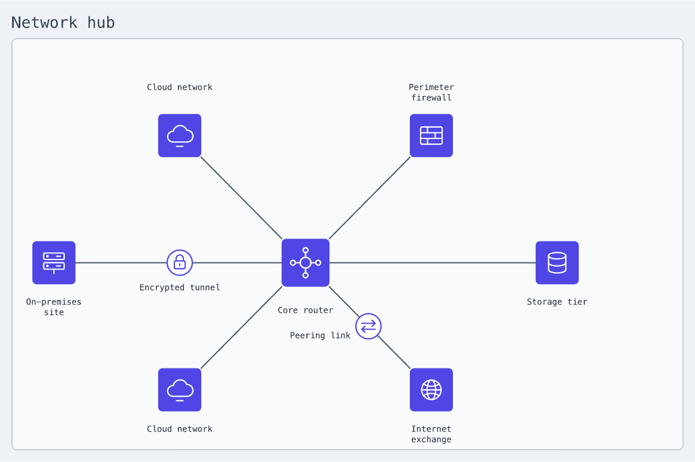
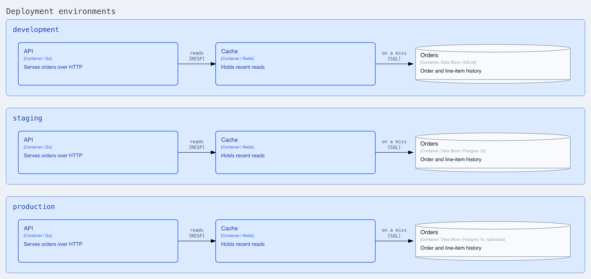
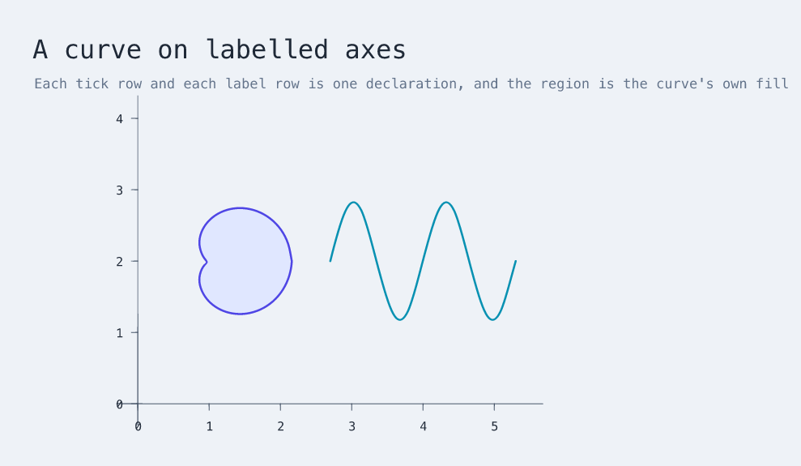
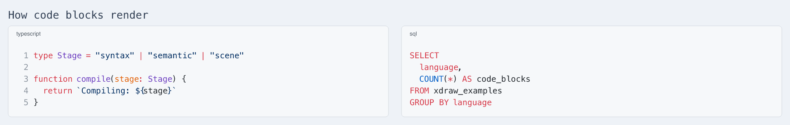

<p align="center">
  
</p>

<p align="center">
  Describe diagrams in text. Keep editing them in Excalidraw.
</p>

<p align="center">
  <a href="#quick-start">Quick start</a> ·
  <a href="#language">Language</a> ·
  <a href="#hosted-scenes">Hosted scenes</a> ·
  <a href="docs/tour.md">Tour</a> ·
  <a href="docs/spec.md">Specification</a>
</p>

XDraw is a small DSL for describing diagrams and drawings. It compiles to
editable Excalidraw scenes and can also render PNG and SVG previews.

## Quick start

You need Node.js 22.18 or newer.

```bash
git clone https://github.com/fractalops/xdraw.git
cd xdraw
npm install
npm link
```

Create `compiler-flow.xdraw`:

```xdraw
use "xdraw/architecture" as arch

diagram "Compiler flow" {
  author: arch.person "XDraw author" {
    description "Describes an editable diagram"
  }
  compiler: arch.system "Parser and compiler" {
    description "Turns source into native Excalidraw elements"
  }
  scene: arch.database "Editable scene" {
    description "Stores the generated diagram"
    technology "Excalidraw JSON"
  }

  author -> compiler "writes source"
  compiler -> scene "emits elements" { technology "JSON" }
}
```

Build it:

```bash
xdraw build compiler-flow.xdraw
```

The command creates `compiler-flow.excalidraw` beside the source file. Open it
in [Excalidraw](https://excalidraw.com) and keep editing there.

Use `-o` to choose the output path or render a preview:

```bash
xdraw build compiler-flow.xdraw -o output/compiler-flow.png
xdraw build examples/xdraw-logo.xdraw -o output/xdraw-logo.png --background transparent
cat compiler-flow.xdraw | xdraw build -o output/compiler-flow.excalidraw
```

## Language

The reference below covers a declaration's anatomy, the primitives, composition,
and the build:


```bash
xdraw build examples/readme-cheatsheet.xdraw
```

For more examples, see the [full cheatsheet](examples/xdraw-cheatsheet.xdraw)
and the [`examples/`](examples/) directory. The [tour](docs/tour.md) explains
how to use the language; the [specification](docs/spec.md) defines its syntax
and semantics.

### Computed layouts

Numbers can be named and computed, so a diagram whose positions follow a rule is
written as that rule. Here a core router and its six links sit on one ring:



Not one coordinate is typed. The ring is stated once, and a link names only
which of the six slots it occupies:

```xdraw
use "xdraw/assets" as assets

diagram "Network hub" {
  let cx = 560
  let cy = 460
  let wide = 420
  let tall = 245
  let slot = tau / 6

  cloud: asset "examples/assets/network/cloud.svg"

  cloud_north: rectangle "" {
    at = (cx + wide * cos(4 * slot) - 36, cy + tall * sin(4 * slot) - 36); size (72, 72)
    background "transparent"; stroke "transparent"
  }
  cloud_north_mark: assets.icon(cloud) {
    at = (cx + wide * cos(4 * slot) - 36, cy + tall * sin(4 * slot) - 36)
    size (72, 72); alt "An attached cloud network"
  }
  cloud_north_name: text "Cloud network" {
    at = (cloud_north.center_x - 65, cloud_north.top - 54)
    size (130, 48); wrap-width 130; auto-size false; align center; font-size 14
  }
}
```

The other five links differ only in their slot number and their icon. The label
is placed from `cloud_north.center_x` and `cloud_north.top`, geometry the
compiler measured rather than anything the document stated, so moving the ring
moves the labels with it. Full source in
[`examples/network-hub.xdraw`](examples/network-hub.xdraw).

A declaration can also repeat. `each` names its instances by item and `count`
names them by position, which is how nine services get placed around a ring
from one `ellipse`. The [tour](docs/tour.md) covers named values, repetition,
and measured geometry in full.

### Reusable structure

A `template` is a shape written once and instantiated wherever it applies. Each
instance owns its elements, so the three environments below share a definition
without sharing any identity:

```xdraw
use "xdraw/architecture" as arch

diagram "Deployment environments" {
  subtitle "One template, instantiated once per environment"

  arrange grid { columns 1; gap 40 }

  tier: template(name, store_tech) {
    env: section "${name}" {
      arrange row { gap 124 }

      api: arch.container "API" {
        description "Serves orders over HTTP"
        technology "Go"
        size (260, 140)
      }
      cache: arch.container "Cache" {
        description "Holds recent reads"
        technology "Redis"
        size (260, 140)
      }
      store: arch.database "Orders" {
        description "Order and line-item history"
        technology "${store_tech}"
        size (260, 140)
      }

      api@right -> cache@left "reads" { technology "RESP" }
      cache@right -> store@left "on a miss" { technology "SQL" }
    }
  }

  dev: tier ("development", "SQLite")
  staging: tier ("staging", "Postgres 15")
  production: tier ("production", "Postgres 15, replicated")
}
```



Here the positions are not computed either. `arrange` places the sections down
the page and the containers across each one, and `@right` and `@left` name where
a connector should attach rather than where it should be drawn.

## Rich content

XDraw renders TeX formulas as SVG while keeping the scene editable:


```bash
xdraw build examples/formulas.xdraw -o output/formulas.png
```

When piping TeX through a shell heredoc, quote the delimiter so the shell
leaves backslashes unchanged:

```bash
xdraw build - -o quadratic.png <<'XDRAW'
use "xdraw/math" as math

diagram "Quadratic formula" {
  root: math.formula """x = \frac{-b \pm \sqrt{b^2 - 4ac}}{2a}"""
}
XDRAW
```

`math.plot` draws a parametric curve from a pair of expressions, sampling it
until the points provably lie within a stated distance of the true curve:


```bash
xdraw build examples/parametric-plots.xdraw -o output/parametric-plots.png
```

A curve it cannot draw to that accuracy, one with a pole, or one that leaves
the usable coordinate range, is refused with a diagnostic rather than
approximated. The [tour](docs/tour.md#plotting-curves) is the guide, and it
also records what curves reach and where they stop.

Curves share a frame, and a closed one encloses a region:



The frame is built from ordinary pieces. A row of ticks and its labels are one
declaration each, placed from the instance's own index, so the whole figure moves
by editing `unit`:

```text
xtick: freedraw {
  count 6
  at = (x0 + unit * xtick.index, y0)
  points ((0, 0), (0, 8))
  stroke "#475569"
  stroke-width 0.4
}
xlabel: text "${index}" {
  count 6
  at = (x0 + unit * xlabel.index - 4, y0 + 18)
  font-size 15
}
```

Full source, both axes and both curves, in
[`examples/labelled-axes.xdraw`](examples/labelled-axes.xdraw).

Tables have measured columns, wrapped cells, and remain editable in Excalidraw:


```bash
xdraw build examples/tables.xdraw -o output/tables.png
```

Code blocks keep their indentation and are coloured token by token, and the
text stays selectable in the scene:



```bash
xdraw build examples/code-blocks.xdraw -o output/code-blocks.png
```

## Hosted scenes

XDraw can also read and update scenes in Excalidraw+. Set an API key, then list
the scenes you can access:

```bash
export EXCALIDRAW_API_KEY="your-api-key"
xdraw list
```

`list` prints a readable address and its scene ID:

```text
ADDRESS                                                     SCENE ID
excalidraw::default::Architecture::System overview          scene-123
```

Use either value with `pull`:

```bash
xdraw pull "excalidraw::default::Architecture::System overview"
xdraw pull scene-123 -o output/system-overview.png
xdraw pull scene-123 -o output/system-overview.svg
```

Use `apply` to create a hosted scene or update an existing one:

```bash
xdraw apply architecture.scene.xdraw
```

The [tour](docs/tour.md#hosted-scenes) covers scene documents, targeted
updates, and API configuration.

## CLI

```text
xdraw build [<file>|-] [-o <output>]
xdraw check [<file>|-]
xdraw apply [<file>|-]
xdraw list [<collection>]
xdraw pull <address-or-id> [-o <output>]
```

- `check` validates without creating output.
- `build` creates a local editable scene or preview.
- `list` discovers hosted scene addresses.
- `apply` sends a replace or patch document to Excalidraw+.
- `pull` retrieves a hosted scene as `.excalidraw`, PNG, or SVG.

`build`, `check`, and `apply` accept a file, standard input, or inline source
with `-e`. Commands that contact Excalidraw+ use `EXCALIDRAW_API_KEY`. Run
`xdraw --help` for the complete command reference.

`check` reports more than syntax. It reads the diagram the way a reviewer
would, and says what it noticed and where:

```text
XD2101: architecture element 'flow.api' should describe its responsibility at 7:5
XD2101: architecture element 'flow.store' should describe its responsibility at 8:5
XD2104: relationships between architecture containers should name their technology or protocol at 10:5
XD2001: layout gap 40 was raised to 98 so connector labels fit at 5:5
XD2006: 'flow.api' and 'flow.store' share a row but differ in height, so their connector will not be level; match-size (flow.api, flow.store) height levels them at 10:5
```

Advisories like these do not stop a build. Errors do, and each one names the
line that caused it.

## Acknowledgements

- [Excalidraw](https://github.com/excalidraw/excalidraw) provides the open scene
  format.
- [ELK](https://github.com/kieler/elkjs) places nodes in flat layered diagrams.
- [Shiki](https://github.com/shikijs/shiki) provides code highlighting.
- [MathJax](https://www.mathjax.org/) renders mathematical formulas.
- [Perfect Freehand](https://github.com/steveruizok/perfect-freehand) generates
  freehand geometry.
- [resvg-js](https://github.com/yisibl/resvg-js) renders local previews.

## Development

```bash
npm run build
npm run typecheck
npm test
npm run test:browser
```

See [Architecture](docs/architecture.md) for the compiler structure and
[Releasing XDraw](docs/releasing.md) for the maintainer workflow.

XDraw is available under the [MIT License](LICENSE).
