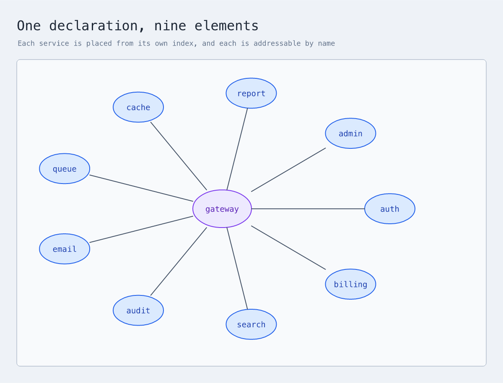
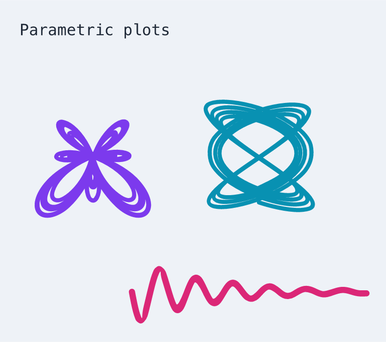

<p align="center">
  
</p>

<p align="center">
  Describe diagrams in text. Keep editing them in Excalidraw.
</p>

<p align="center">
  <a href="#quick-start">Quick start</a> ·
  <a href="#language">Language</a> ·
  <a href="#hosted-scenes">Hosted scenes</a> ·
  <a href="docs/language-reference.md">Guide</a> ·
  <a href="docs/spec.md">Specification</a>
</p>

XDraw is a small DSL for describing diagrams and drawings. It compiles to
editable Excalidraw scenes and can also render PNG and SVG previews.

## Quick Start

You need Node.js 22.18 or newer.

```bash
git clone https://github.com/fractalops/xdraw.git
cd xdraw
npm install
npm link
```

Create `compiler-flow.xdraw`:

```xdraw
use "xdraw/architecture" as arch

diagram "Compiler flow" {
  author: arch.person "XDraw author" {
    description "Describes an editable diagram"
  }
  compiler: arch.system "Parser and compiler" {
    description "Turns source into native Excalidraw elements"
  }
  scene: arch.database "Editable scene" {
    description "Stores the generated diagram"
    technology "Excalidraw JSON"
  }

  author -> compiler "writes source"
  compiler -> scene "emits elements" { technology "JSON" }
}
```

Build it:

```bash
xdraw build compiler-flow.xdraw
```

The command creates `compiler-flow.excalidraw` beside the source file. Open it
in [Excalidraw](https://excalidraw.com) and keep editing there.

Use `-o` to choose the output path or render a preview:

```bash
xdraw build compiler-flow.xdraw -o output/compiler-flow.png
xdraw build examples/xdraw-logo.xdraw -o output/xdraw-logo.png --background transparent
cat compiler-flow.xdraw | xdraw build -o output/compiler-flow.excalidraw
```

## Language

This quick reference covers declarations, core primitives, and composition:


```bash
xdraw build examples/readme-cheatsheet.xdraw
```

For more examples, see the [full cheatsheet](examples/xdraw-cheatsheet.xdraw)
and the [`examples/`](examples/) directory. The
[language guide](docs/language-reference.md) explains how to use the language;
the [specification](docs/spec.md) defines its syntax and semantics.

### Computed layouts

Numbers can be named, computed, and repeated, so a diagram whose positions
follow a rule is written as that rule:

```xdraw
diagram "Ring" {
  let hub = 380
  let ring = 210

  spoke: ellipse "${each}" {
    each ("auth", "billing", "search", "audit", "email")
    at = (hub + ring * cos(tau * spoke.index / spoke.count),
          hub + ring * sin(tau * spoke.index / spoke.count))
    size (120, 72)
  }
}
```



A position can also come from an element the compiler has already measured,
which is how an annotation stays attached to a box whose size depends on its
text:

```text
label: text "beside the last box" {
  at = (flow.emit.right + 24, flow.emit.center_y)
}
```

[Named values](docs/named-values.md), [repetition](docs/repetition.md), and
[measured geometry](docs/geometry-references.md) cover these in full.

## Rich Content

XDraw renders TeX formulas as SVG while keeping the scene editable:


```bash
xdraw build examples/formulas.xdraw -o output/formulas.png
```

When piping TeX through a shell heredoc, quote the delimiter so the shell
leaves backslashes unchanged:

```bash
xdraw build - -o quadratic.png <<'XDRAW'
use "xdraw/math" as math

diagram "Quadratic formula" {
  root: math.formula """x = \frac{-b \pm \sqrt{b^2 - 4ac}}{2a}"""
}
XDRAW
```

`math.plot` draws a parametric curve from a pair of expressions, and guarantees
the drawn line stays within a stated distance of the true curve:



```bash
xdraw build examples/parametric-plots.xdraw -o output/parametric-plots.png
```

A curve it cannot draw to that accuracy, one with a pole, or one that leaves
the usable coordinate range, is refused with a diagnostic rather than
approximated. See [Plotting curves](docs/plotting.md) for the guide and
[the gallery](docs/curve-gallery.md) for what it manages and where it stops.

Tables have measured columns, wrapped cells, and remain editable in Excalidraw:


```bash
xdraw build examples/tables.xdraw -o output/tables.png
```

## Hosted Scenes

XDraw can also read and update scenes in Excalidraw+. Set an API key, then list
the scenes you can access:

```bash
export EXCALIDRAW_API_KEY="your-api-key"
xdraw list
```

`list` prints a readable address and its scene ID:

```text
ADDRESS                                                     SCENE ID
excalidraw::default::Architecture::System overview          scene-123
```

Use either value with `pull`:

```bash
xdraw pull "excalidraw::default::Architecture::System overview"
xdraw pull scene-123 -o output/system-overview.png
xdraw pull scene-123 -o output/system-overview.svg
```

Use `apply` to create a hosted scene or update an existing one:

```bash
xdraw apply architecture.scene.xdraw
```

The [Excalidraw+ guide](docs/excalidraw-plus-integration.md) covers scene
documents, targeted updates, permissions, and API configuration.

## CLI

```text
xdraw build [<file>|-] [-o <output>]
xdraw check [<file>|-]
xdraw apply [<file>|-]
xdraw list [<collection>]
xdraw pull <address-or-id> [-o <output>]
```

- `check` validates without creating output.
- `build` creates a local editable scene or preview.
- `list` discovers hosted scene addresses.
- `apply` sends a replace or patch document to Excalidraw+.
- `pull` retrieves a hosted scene as `.excalidraw`, PNG, or SVG.

`build`, `check`, and `apply` accept a file, standard input, or inline source
with `-e`. Commands that contact Excalidraw+ use `EXCALIDRAW_API_KEY`. Run
`xdraw --help` for the complete command reference.

## Acknowledgements

- [Excalidraw](https://github.com/excalidraw/excalidraw) provides the open scene
  format.
- [ELK](https://github.com/kieler/elkjs) places nodes in flat layered diagrams.
- [Shiki](https://github.com/shikijs/shiki) provides code highlighting.
- [MathJax](https://www.mathjax.org/) renders mathematical formulas.
- [Perfect Freehand](https://github.com/steveruizok/perfect-freehand) generates
  freehand geometry.
- [resvg-js](https://github.com/yisibl/resvg-js) renders local previews.

## Development

```bash
npm run build
npm run typecheck
npm test
npm run test:browser
```

See [Architecture](docs/architecture.md) for the compiler structure and
[Releasing XDraw](docs/releasing.md) for the maintainer workflow.

XDraw is available under the [MIT License](LICENSE).
