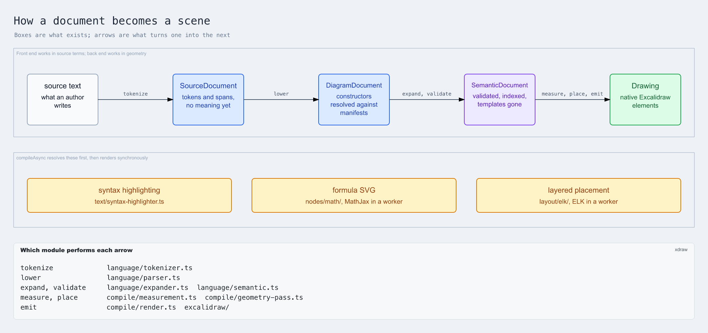
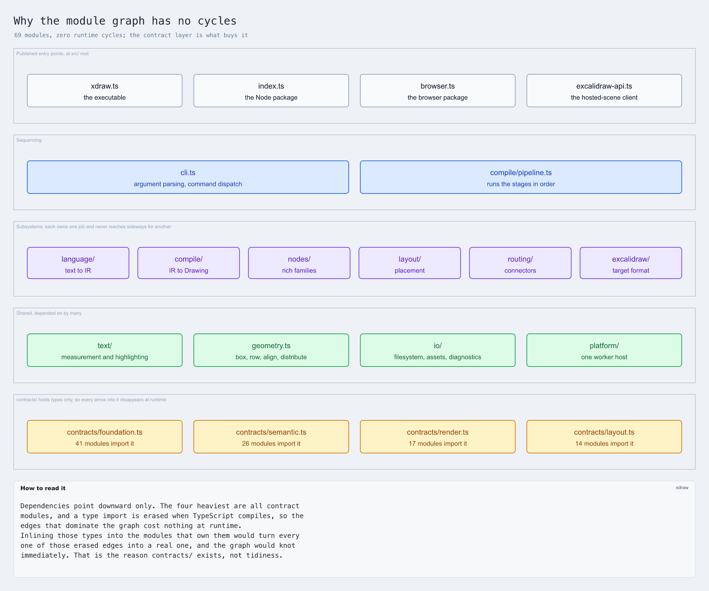
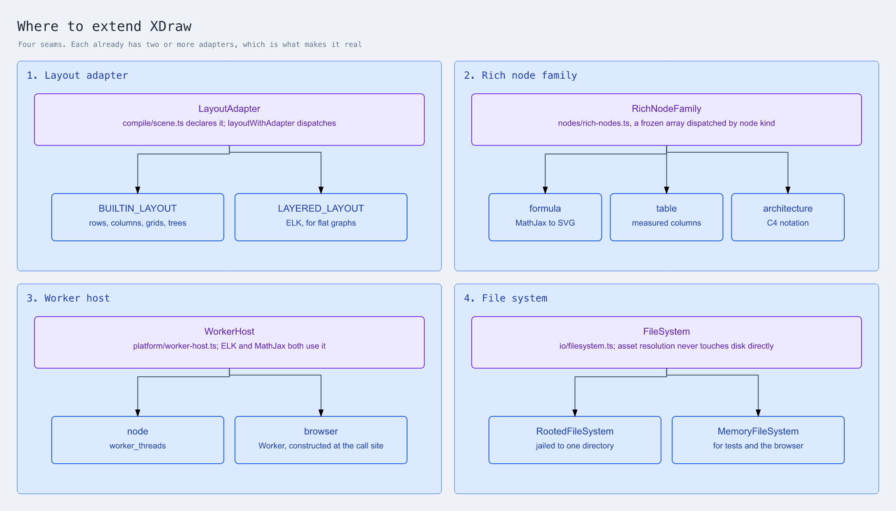
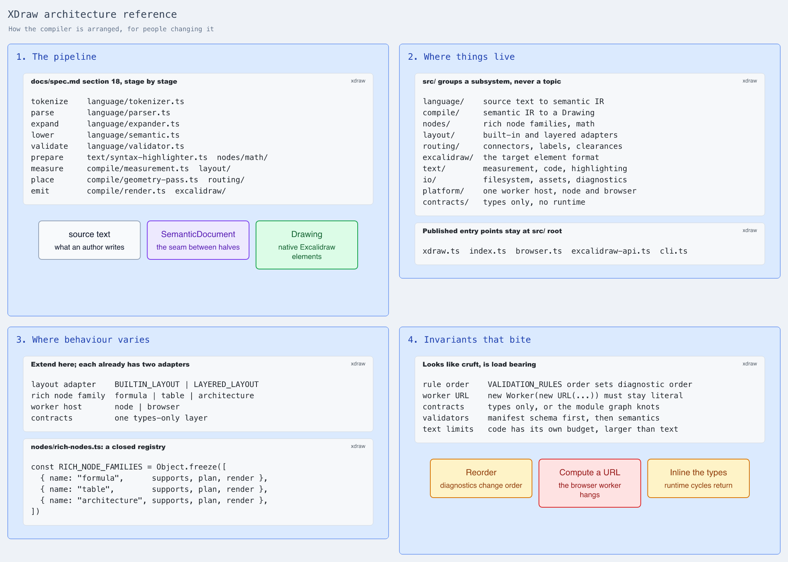

# Architecture

This page is a primer for contributors who need to navigate the compiler. It
follows a document from source text to an Excalidraw scene, naming the module
that owns each step so you can read the code alongside it.

The [language specification](spec.md) defines what the language means. This page
describes where and how the compiler implements it.

The diagrams are generated from runnable examples under
[`examples/`](../examples/); the test suite compiles them and
`npm run docs:images` regenerates the images.

## Compilation flow

The boxes are the artifacts that exist at each point. The arrows are the
transformations between them. Each is described below in the order it runs.

`SemanticDocument` is the seam. Everything before it works in source terms —
tokens, spans, constructors, templates. Everything after works in geometry —
measured text, positioned bounds, routed connectors. Most changes belong
entirely on one side of it, so identifying the side first narrows the search.

## Entry points

[`src/compile/pipeline.ts`](../src/compile/pipeline.ts) sequences the stages and
does nothing else. No single module is "the compiler".

It exports two entry points:

- `compile` renders synchronously.
- `compileAsync` first resolves the three inputs that cannot be produced
  synchronously — syntax highlighting, formula rasterisation, and ELK placement
  — then hands the results to the same renderer.

The asynchrony sits at the edges. Rendering itself is pure, which is why scene
output is reproducible.

[`src/cli.ts`](../src/cli.ts) is the other way in. It parses arguments, reads a
file or standard input, and calls `compileAsync`.

## Tokenizing and parsing

[`src/language/tokenizer.ts`](../src/language/tokenizer.ts) turns source text
into tokens that retain their offsets, so every later diagnostic can name a line
and column.

[`src/language/parser.ts`](../src/language/parser.ts) has two halves.
`parseSyntax` builds a `SourceDocument` — structure without meaning.
`lowerSyntax` then resolves that against the library manifests and produces a
`DiagramDocument`. `parseSource` runs both.

The manifests live in
[`src/language/manifests/`](../src/language/manifests/): `contracts.ts` holds
the types, `schema.ts` validates a manifest at load, and `builtins.ts` holds the
standard libraries XDraw ships.

## Validating against the language

[`src/language/validator.ts`](../src/language/validator.ts) checks a document
against those manifests: constructor names, property names and kinds, argument
arity, and child rules. It throws `LanguageValidationError` on the first
problem, before any semantic work begins.

This is the stage that produces "unknown constructor" and "does not accept
property" messages, including their suggestions.

## Expanding and lowering

[`src/language/expander.ts`](../src/language/expander.ts) inlines templates and
gives the expanded declarations hygienic identifiers, so two uses of one
template cannot collide.

[`src/language/semantic.ts`](../src/language/semantic.ts) lowers the expanded
AST into a `SemanticDocument`: it lowers decision branches, indexes every
object and reference, and runs `validateSemanticDocument`.

That validator is a frozen array of rule families applied to each statement.
**Array order is part of the contract** — it determines the order diagnostics
appear in, which `test/semantic-diagnostics.test.ts` pins.

## Expressions and plotted curves

[`src/language/expression.ts`](../src/language/expression.ts) is a bounded
expression sublanguage — eighteen functions, three constants, five operators,
and one free variable bound by the caller. It follows Vega's restriction list:
no assignment, no control flow, no property access. It is reachable from one
constructor and is not the language growing general expressions.

Two size limits bound it, and they catch different shapes. `MAXIMUM_NESTING`
bounds parser recursion, which is what a deep chain of parentheses exhausts.
`MAXIMUM_NODES` bounds the tree, which is what a long left-associative chain
exhausts — `t+1+1+1…` is consumed by a loop rather than by recursion, so the
parser never nests while the tree grows one level per term, and the stack then
overflows in the evaluator rather than in the parser.

[`src/language/interval.ts`](../src/language/interval.ts) evaluates the same
expressions over an interval rather than at a point, producing a range that
contains every value the expression takes across it.

[`src/language/curve-sampler.ts`](../src/language/curve-sampler.ts) uses that to
turn a pair of expressions into a polyline. **Its tolerance is a bound, not an
estimate**, and that distinction is the reason the interval module exists —
see the constraints below.

`math.plot` lowers to a *description* — its equations, domain and tolerance —
and [`src/compile/plot-pass.ts`](../src/compile/plot-pass.ts) draws it into a
`freedraw` statement afterwards. The split matters: the pass runs after
templates expand, so a template may supply a value to an equation, and before
the document is validated, so the freehand limits apply to a plotted curve
exactly as they do to a drawn one. Sampling in the parser froze a curve before
the template could reach it.

`let` bindings resolve in [`src/language/bindings.ts`](../src/language/bindings.ts)
and are folded into the document by `lowerSyntax`. They are constants, so this
happens while the document is read; an expression that still holds a name
another binder supplies keeps its expression with the known parts substituted.

## Measuring and placing

[`src/compile/scene.ts`](../src/compile/scene.ts) builds the `SceneGraph` that
the rest of compilation mutates, and `layoutWithAdapter` dispatches to a layout
adapter after checking the document's requirements against that adapter's
capabilities.

[`src/compile/measurement.ts`](../src/compile/measurement.ts) sizes content
before it can be placed, using the font metrics in
[`src/text/`](../src/text/).

[`src/layout/`](../src/layout/) holds the adapters: `builtin.ts` for rows,
columns, grids, and trees, and `layered.ts` for flat graphs via ELK. The ELK
integration runs in a worker; see [`src/layout/elk/`](../src/layout/elk/).

[`src/compile/geometry-references.ts`](../src/compile/geometry-references.ts)
resolves an `at` that names another element's geometry, against the boxes layout
has just produced. Only text and freehand may refer, because they take no part in
layout — a node placed with `at` displaces the very box it would be measuring.

[`src/compile/geometry-pass.ts`](../src/compile/geometry-pass.ts) then applies
the precision-geometry statements — alignment, distribution, offset,
`match-size`, rotation, and snapping. These run **after** automatic layout, so
they override it rather than participate in it.

[`src/routing/`](../src/routing/) routes connectors around the placed nodes and
positions their labels.

## Emitting

[`src/compile/render.ts`](../src/compile/render.ts) drives the whole back half
and produces a `Drawing`. It is the widest module in the codebase, importing
around two dozen others, because it is where measurement, layout, geometry,
routing, and emission meet.

[`src/excalidraw/`](../src/excalidraw/) owns the target format: the `Drawing`
document, element and component constructors, and the adapter that turns scene
visuals into native elements.

[`src/nodes/`](../src/nodes/) handles content that needs more than a shape:
`rich-nodes.ts` dispatches by node kind to the formula, table, and architecture
families, with the math subsystem under `nodes/math/`.

## Module layers

Dependencies point downward. The four most imported modules are in
[`src/contracts/`](../src/contracts/) and hold types only, so TypeScript erases
those imports and they cost nothing at run time. That is what keeps the module
graph free of runtime cycles.

Keep shared types in `contracts/`. Moving them into the modules that use them
converts type-only edges into runtime edges and makes cycles easy to introduce.

Modules named in the package `exports` map — `index.ts`, `browser.ts`,
`xdraw.ts`, `excalidraw-api.ts` — stay at the `src/` root, because moving one
changes the published package layout.

## Extension points

Four seams, each with two or more existing implementations:

| seam | declared in | implementations |
| --- | --- | --- |
| layout adapter | [`compile/scene.ts`](../src/compile/scene.ts) | `BUILTIN_LAYOUT`, `LAYERED_LAYOUT` |
| rich node family | [`nodes/rich-nodes.ts`](../src/nodes/rich-nodes.ts) | formula, table, architecture |
| worker host | [`platform/worker-host.ts`](../src/platform/worker-host.ts) | node, browser |
| file system | [`io/filesystem.ts`](../src/io/filesystem.ts) | rooted, in-memory |

Prefer adding an implementation behind an existing seam. Introduce a new one
only when a second concrete use exists — one implementation is a hypothetical
seam, two is a real one.

## Constraints worth knowing

These look incidental and are not.

- **Validation-rule order is observable.** It sets the order of returned
  diagnostics.
- **Browser worker construction must stay a literal.** Bundlers only detect a
  worker when they can see `new Worker(new URL("./worker-browser.js",
  import.meta.url))` written out. Computing that URL produces a page that hangs
  with no error.
- **`contracts/` holds types only.** See the module-layer section above.
- **Two validators run, and both are load-bearing.** `language/validator.ts`
  checks documents against manifests; `validateSemanticDocument` checks semantic
  constraints. The overlap is deliberate: `compile` accepts a `SemanticDocument`,
  so a caller can bypass the parser entirely.
- **Code has its own size budget**, larger than the one for display text. See
  [`src/text/policy.ts`](../src/text/policy.ts).
- **Property names are global.** [`src/language/registry.ts`](../src/language/registry.ts)
  builds one name-to-kind map across every constructor in every library, and
  throws at load if two constructors give the same property name different
  kinds. Reusing a name means accepting its existing kind.
- **A curve sampled to a tolerance is bounded, not estimated.** Subdividing
  until a few interior samples look close enough says nothing about the points
  between them; measured against curves of high frequency that approach
  exceeded its stated tolerance by up to twenty seven times and reported
  success. Enclosing each span with interval arithmetic makes flatness provable,
  because distance to a segment is convex and a box is convex, so the maximum is
  attained at a corner. The same enclosure is what finds poles and what checks
  the magnitude limit, so all three are one mechanism rather than three. The
  bounds use double precision without directed rounding, so the guarantee holds
  to within floating-point error in the bounds themselves.
- **Interval rules must over-estimate, never under-estimate.** A range that is
  too wide costs subdivision; a range that is too narrow silently produces a
  wrong curve. Where a tight rule would be intricate — `atan2` across its branch
  cut, a fractional power of a negative base — the rules widen to the whole line
  and let the caller subdivide.

## Reference card

A single-page summary of the above: the specification's
[nine processing steps](spec.md) mapped to their modules, the directory layout,
the seams, and the constraints.

## Testing

- `npm test` runs the Node suite.
- `npm run test:browser` runs Playwright acceptance tests against a packaged
  build.
- `npm run test:types` checks the published type declarations.
- `test/corpus.test.ts` pins compiled output by fingerprint. When it fails,
  inspect the scene diff before accepting a new fingerprint — the failure means
  output changed, not that the test is stale.
