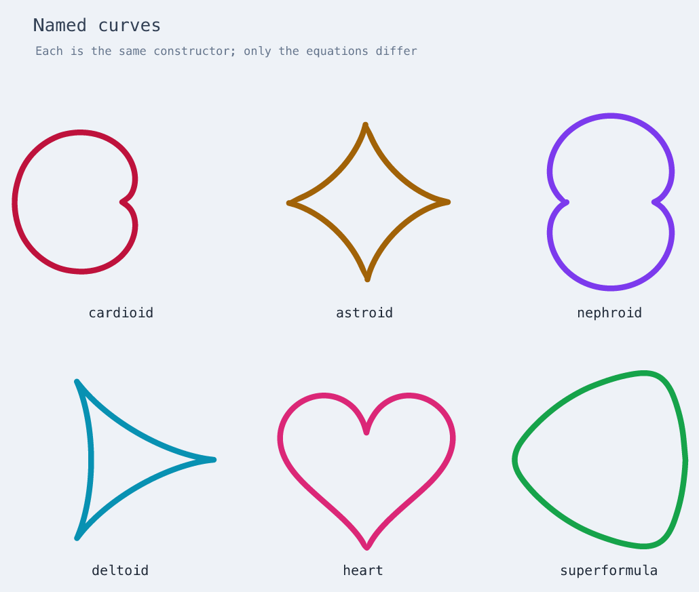
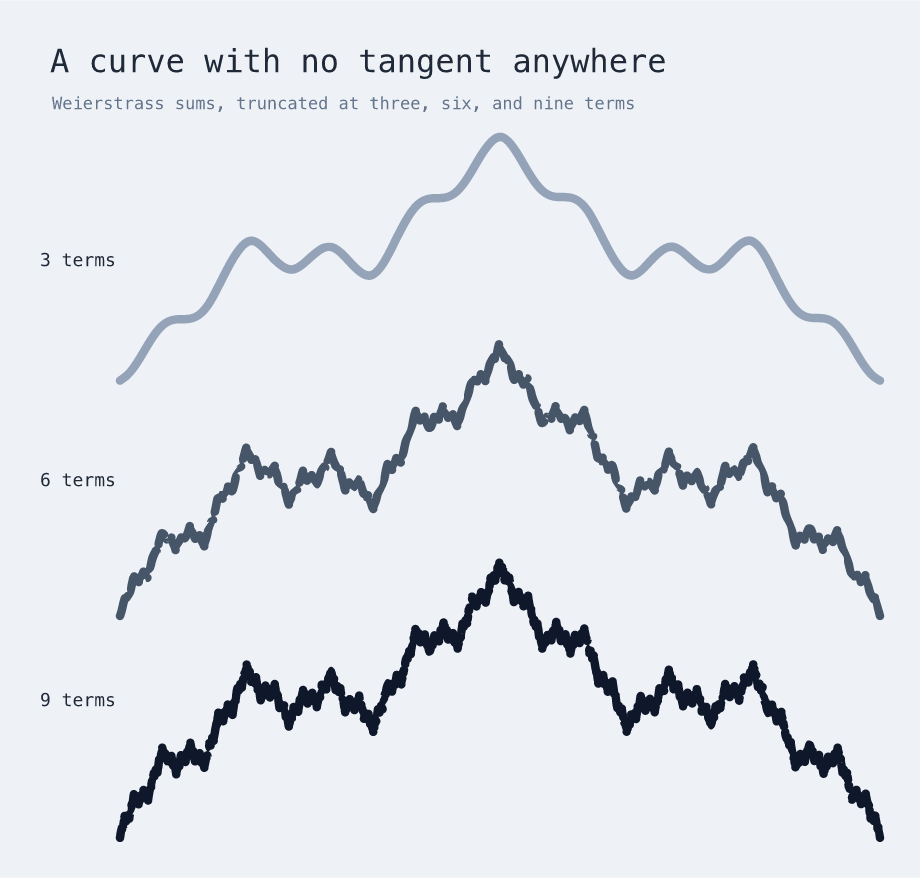
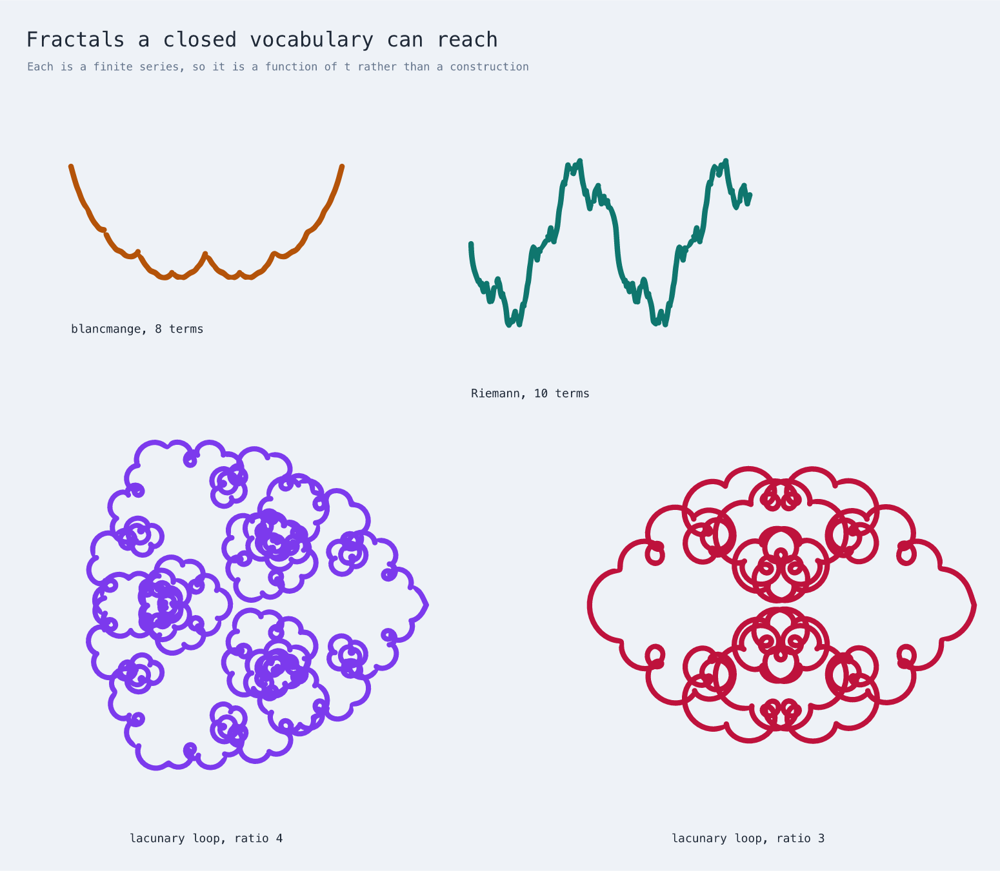
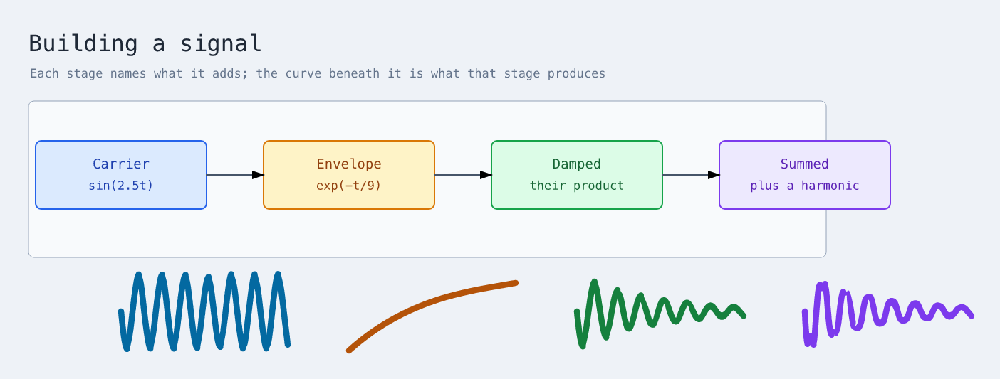

# A gallery, and where it breaks

Everything here is `math.plot` with different equations. No curve is a special
case in the compiler, and every figure was produced by compiling a file in
[`examples/`](../examples/). [Plotting curves](plotting.md) is the guide; this
page is the stress test.

## Named curves



```
cardioid      x = 80·(1 − cos t)·cos t
astroid       x = 120·cos³t                       y = 120·sin³t
nephroid      x = 32·(3cos t − cos 3t)            y = 32·(3sin t − sin 3t)
deltoid       x = 45·(2cos t + cos 2t)            y = 45·(2sin t − sin 2t)
heart         x = 128·sin³t                       y = −8·(13cos t − 5cos 2t − 2cos 3t − cos 4t)
superformula  r = (|cos(3t/4)|⁸ + |sin(3t/4)|⁸)^(−1/8),  x = 110·r·cos t
```

The superformula is the one that stretches the vocabulary: it needs `abs`, a
fractional power, and a negative exponent, and it works because those are all
in the closed function set. Written out in full:

```xdraw
use "xdraw/math" as math

diagram "Superformula" {
  shape: math.plot {
    at (200, 200)
    x = 110 * ((abs(cos(3*t/4))) ^ 8 + (abs(sin(3*t/4))) ^ 8) ^ -0.125 * cos(t)
    y = 110 * ((abs(cos(3*t/4))) ^ 8 + (abs(sin(3*t/4))) ^ 8) ^ -0.125 * sin(t)
    domain (0, tau)
    stroke "#16a34a"
  }
}
```

The rest of the gallery is in
[`examples/curve-gallery.xdraw`](../examples/curve-gallery.xdraw).

## A curve with no tangent anywhere



A [Weierstrass function](https://mathworld.wolfram.com/WeierstrassFunction.html)
is continuous everywhere and differentiable nowhere — the classic
counterexample to the intuition that a continuous curve must have a tangent
almost everywhere. Truncating the sum at *k* terms gives something drawable:

```
y = 70·( cos πt + ½cos 3πt + ¼cos 9πt + … + 2⁻ᵏ⁻¹cos 3ᵏ⁻¹πt )
```

Three rows, at three, six, and nine terms. The self-similarity is the point:
each row is the one above it with finer detail added on the same skeleton, and
the ninth term oscillates 6561 times faster than the first.

This is the hardest case the sampler handles well. **It is exactly the shape
the old sampler got wrong** — high frequency riding on low — and the reason the
tolerance had to become a bound rather than an estimate. Nine terms needs 3917
points and 409 ms, and the drawn line stays within 0.484px of the true curve.
Source: [`examples/fractal-curve.xdraw`](../examples/fractal-curve.xdraw).

## Fractals: what a closed vocabulary reaches, and what it cannot

Wikipedia's [fractal article](https://en.wikipedia.org/wiki/Fractal) names
sixteen or so fractals. **None of them can be drawn here**, and the reason is
worth stating precisely, because it is not accuracy and not a budget.

Every one is defined by *doing something repeatedly*: an iterated function
system (Koch snowflake, Cantor set, Sierpinski carpet, Menger sponge, dragon
curve, Peano curve), escape-time iteration on a complex number (Mandelbrot,
Julia, Burning Ship, Lyapunov), or a random process (Lévy flight, Brownian
tree). A plot is a function of one parameter, evaluated once per point. There
is no way to say "repeat this transformation", and no complex arithmetic, so
those constructions are out of reach by shape rather than by degree. No larger
budget or finer tolerance brings them closer.

What *is* reachable is the other family of fractals — the ones defined by a
convergent series, which truncate to an ordinary function of `t`:



```
blancmange     y = Σ 2⁻ⁿ · σ(2ⁿt)          σ = distance to the nearest integer
Riemann        y = Σ sin(n²t) / n²
lacunary loop  x + iy = Σ aⁿ · e^(i·bⁿt)   drawn as two real series
```

The lacunary loops are the pretty ones, and they are genuinely self-similar:
each lobe carries a smaller copy of the whole figure. They are also the most
expensive thing here — the ratio-4 loop takes 2,049 points at a 1px tolerance.

### The finding worth keeping

The blancmange curve needs *distance from t to the nearest integer*, and there
are two ways to write it:

```
abs(u - round(u))            mentions u twice   — cannot be sampled
abs(asin(sin(pi * u))) / pi  mentions u once    — 311 points
```

**They agree to the last digit at every value of t**, and the first one is
refused at every truncation depth while the second draws in a few hundred
points. This is the dependency problem at its sharpest: interval arithmetic
cannot see that two occurrences of `u` move together, so `u - round(u)` is
enclosed as though the two were independent, and the enclosure never tightens
enough to pass. The limit is on how the function is *written*, not on what it
computes. Both spellings and both outcomes are pinned in
`test/curve-sampler.test.ts`.

## Curves in a diagram



A plot is an ordinary stroke, so it sits in a diagram with nodes, styles, and
connections. Here each stage names what it contributes and the curve beneath
shows the result: a carrier, an envelope, their product, and the sum with a
faster harmonic. Source:
[`examples/plot-flow.xdraw`](../examples/plot-flow.xdraw).

## What held

Sixteen curves at a 0.5px tolerance, with the true worst departure measured
afterwards by dense probing rather than trusted from the sampler:

| curve | nodes | points | ms | worst | |
|---|--:|--:|--:|--:|---|
| hypotrochoid (spirograph) | 30 | 239 | 16 | 0.172 | held |
| epitrochoid | 30 | 513 | 21 | 0.162 | held |
| heart | 35 | 109 | 5 | 0.255 | held |
| astroid | 12 | 81 | 2 | 0.209 | held |
| nephroid | 22 | 129 | 4 | 0.217 | held |
| deltoid | 22 | 67 | 2 | 0.144 | held |
| cardioid | 18 | 69 | 2 | 0.356 | held |
| logarithmic spiral | 18 | 125 | 4 | 0.415 | held |
| cycloid | 12 | 65 | 1 | 0.325 | held |
| rose, 13 petals | 22 | 569 | 19 | 0.450 | held |
| superformula | 56 | 75 | 6 | 0.257 | held |
| Weierstrass, 5 terms | 49 | 337 | 21 | 0.441 | held |
| Weierstrass, 7 terms | 67 | 1357 | 110 | 0.431 | held |
| Weierstrass, 9 terms | 85 | 3917 | 409 | 0.484 | held |
| Lissajous 9:8 | 14 | 505 | 10 | 0.427 | held |
| harmonograph, 4 terms | 54 | 1083 | 70 | 0.478 | held |

Not one exceeded its tolerance. The closest was 0.484 of 0.5.

## Where it breaks

It does break, and this is the useful half. Every limit below produces a
diagnostic naming what was hit — never a wrong curve, a crash, or a hang.

**The default point budget, at around ten thousand oscillations.** A Weierstrass
sum of eleven terms, or `sin(5000·t)` over a unit range, exhausts 5,000 points
before reaching a half-pixel tolerance:

```
sampling exceeded 5000 points before reaching a tolerance of 0.5
```

Raising `maximumPoints` gets further — thirteen terms draws in 6,213 points and
896 ms — so the wall is the budget rather than the method. A coarser tolerance
is usually the better answer.

**The expression size limit, at 512 terms.** A Weierstrass sum of about forty
terms still parses; sixty does not:

```
expression holds more than 512 terms
```

**The magnitude limit**, at a million pixels, which `exp(t)` crosses around
t = 14.

**A `domain` end takes a number or a constant, not arithmetic.** `(0, tau)`
works and `(0, 6 * tau)` does not, so the twelve turns a butterfly curve needs
are still written as `37.699111843077517`.

## One bug this found

Writing the flow diagram turned up a real defect: a plot could not be nested
inside a `frame`, `group`, or `section`.

```
constructor 'frame' does not accept child kind 'plot'
```

A plot lowers to a freehand stroke, which every container already accepts, but
the child policy is checked against the *declared* semantic kind rather than
what it lowers to — and `plot` had never been added to the list. Fixed, and
pinned by a test that fails if the entry is removed again.

## Sources

- [Hypotrochoid](https://mathworld.wolfram.com/Hypotrochoid.html) and
  [Epitrochoid](https://mathworld.wolfram.com/Epitrochoid.html), MathWorld
- [Rose curve](https://mathworld.wolfram.com/RoseCurve.html), MathWorld
- [Weierstrass function](https://mathworld.wolfram.com/WeierstrassFunction.html),
  MathWorld
- [Roulettes and spirograph curves](http://www.geom.uiuc.edu/docs/reference/CRC-formulas/node34.html),
  CRC Standard Curves and Surfaces
