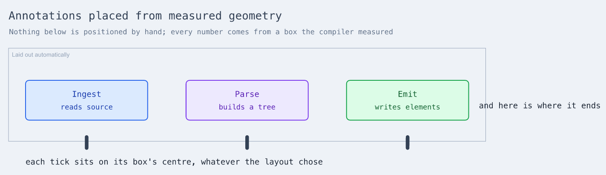
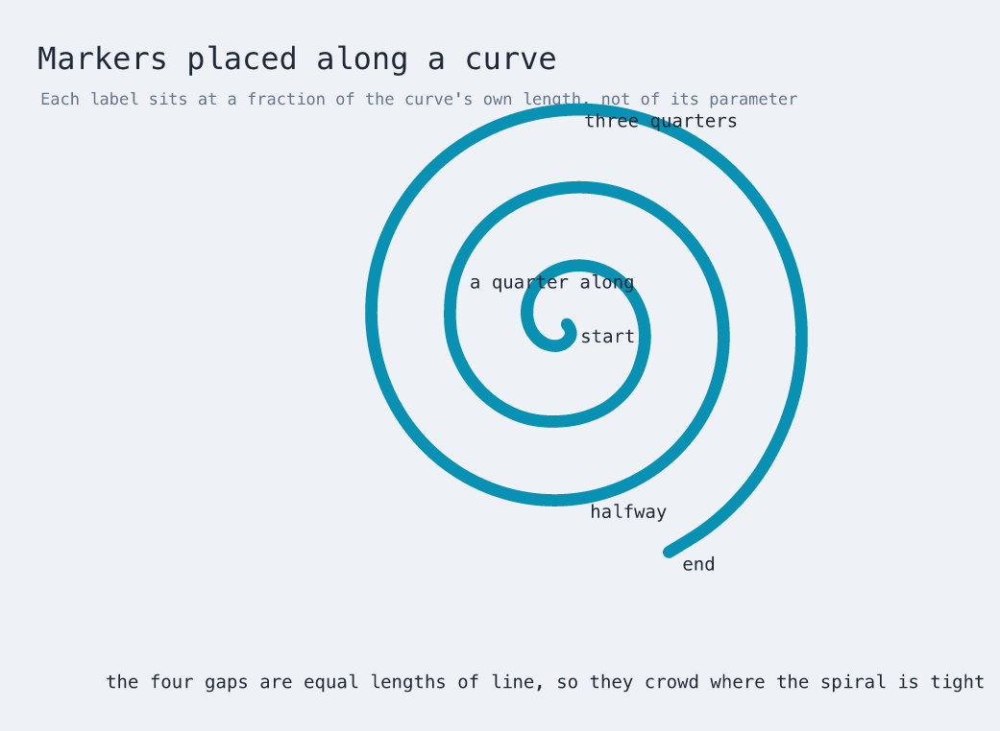

# Placing from measured geometry

An expression may name another element's geometry:

```xdraw
use "xdraw/palette" as palette

diagram "Measured" {
  flow: frame "Laid out automatically" {
    arrange row { gap 90 }
    ingest: rectangle "Ingest" { style palette.info }
    emit: rectangle "Emit" { style palette.success }
  }

  label: text "beside the last box" {
    at = (flow.emit.right + 24, flow.emit.center_y)
  }
}
```



Every tick above sits on a box the compiler measured and the layout placed. None
of those numbers appears in the source, and none could be written down: they
depend on the text inside each box and the gap the layout chose. Full source in
[`examples/measured-annotations.xdraw`](../examples/measured-annotations.xdraw).

## The parts of a box

| | |
|---|---|
| edges | `left` `right` `top` `bottom` |
| size | `width` `height` |
| centre | `center_x` `center_y` |

A reference is written `element.part`, and a nested element keeps its qualified
name: `flow.ingest.right`. The parts are a closed set and none contains a dot,
so the last segment is always the part — which is what makes
`flow.ingest.right` unambiguous even though `flow.ingest` is itself a name.

References compose with arithmetic and with `let`:

```xdraw
diagram "" {
  let margin = 40
  flow: frame "F" {
    arrange row { gap 70 }
    a: rectangle "A"
    b: rectangle "B"
  }
  note: text "note" { at = (flow.b.right + margin, flow.a.top - margin) }
}
```

## What may refer, and what may be referred to

**Text and freehand may refer.** They are drawn where they are told and take no
part in layout.

**A node may not.** A node placed with `at` participates in document layout — the
document grows to contain it and everything else shifts — so resolving its
position against a box it had already displaced would need resolving again. The
dependency would be between placement and layout rather than between two names,
which no amount of cycle detection can see. Measured: adding one absolutely
placed rectangle moved the frame it would have referenced from y=118 to y=731.

**Only laid-out elements may be referred to.** Nodes, frames, sections and
groups have boxes. Text and freehand do not, because they were never placed by
the layout, so they are not addressable:

```
text 'b': no element 'a' to take 'right' from
```

That also disposes of mutual reference: two elements pointing at each other
cannot both be detached and both be measurable.

## A point along a curve

`along_x(curve, u)` and `along_y(curve, u)` give a point on a drawn stroke:
`u = 0` is its start, `u = 1` its end.

```xdraw
use "xdraw/math" as math

diagram "Markers" {
  spiral: math.plot {
    at (620, 340)
    x = 13 * t * cos(t)
    y = 13 * t * sin(t)
    domain (0, 20)
    stroke "#0891b2"
  }
  half: text "halfway" {
    at = (along_x(spiral, 0.5) + 14, along_y(spiral, 0.5))
  }
}
```



The fraction is **arc length, not parameter**. Halfway along a spiral is halfway
along the line you can see, not halfway through the range of `t` — which is why
the markers above crowd near the centre, where the same length of line covers
much less ground. A fraction outside 0…1 is clamped to the ends.

Only strokes can be walked, since only they have points:

```
along expects a stroke, and 'box' is not one
along_x takes a stroke and a fraction from 0 to 1
```

## What is rejected

```
no element 'mystery' to take 'right' from      the element does not exist
unknown name 'flow.ingest.middle'              'middle' is not a part of a box
```

A reference that cannot be resolved is a diagnostic naming what was missing,
rather than a silent zero.

## Where it runs

After layout, in [`src/compile/geometry-references.ts`](../src/compile/geometry-references.ts).
A `let` binding is a constant and is folded while the document is read; these
numbers do not exist until measurement and layout have produced them, so they
are resolved in their own pass over the boxes the compiler actually placed.
