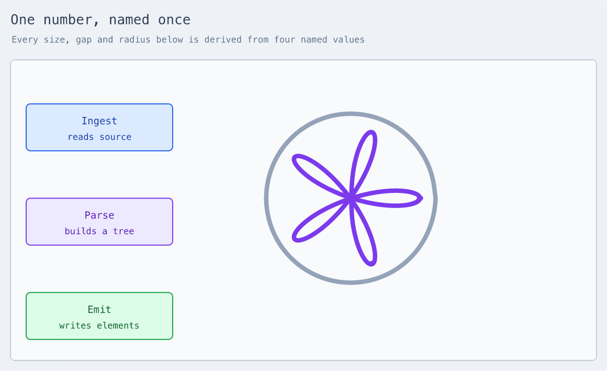

# Named values

A document may name a number and reuse it.

```xdraw
use "xdraw/math" as math

diagram "One number, named once" {
  let unit = 56
  let card = unit * 5
  let radius = unit * 2.4

  first: rectangle "Ingest" { at (100, 220); size = (card, unit * 1.6) }

  rose: math.plot {
    at (720, 400)
    x = radius * cos(5 * t) * cos(t)
    y = radius * cos(5 * t) * sin(t)
    domain (0, tau)
  }
}
```



Change `unit` and the cards, the gaps and the flower all move together. The full
source is [`examples/named-values.xdraw`](../examples/named-values.xdraw).

## Why

The most duplicated construct in this repository's own diagrams was a number.
One file repeats `size (390, 96)` eight times; another repeats `size (255, 92)`
six times. There was no way to say it once.

## What a binding may contain

Anything the [expression sublanguage](plotting.md) accepts, plus any name bound
earlier or later in the same document:

```xdraw
diagram "" {
  let unit = 56
  let card = unit * 5
  let diagonal = hypot(card, unit)
  let turn = tau / 6
  a: rectangle "A" { at (0, 0); stroke-width = 2 }
}
```

Bindings resolve by **what they depend on, not by where they appear**, so a
document may read in whatever order suits it:

```xdraw
diagram "" {
  let gap = card / 4
  let card = 260
  a: rectangle "A" { at (0, 0); stroke-width = gap / 32 }
}
```

## Where a bound name may be used

Anywhere a number is written, after an `=`:

```
stroke-width = base            a single number
size = (card, card / 2)        a pair
x = radius * cos(t)            an expression that keeps its own variable
```

The last one matters. A plotted curve's `t` is bound by the sampler rather than
by the document, so `radius` is folded in and `t` is left for whoever binds it.

## What is rejected, and how it reads

```
let a = b + 1        'a' depends on itself: a -> b -> a
let b = a + 1

let a = a + 1        'a' depends on itself: a -> a
let a = mystery * 2  unknown name 'mystery', used by 'a'
let a = 1            'a' is bound more than once
let a = 2
let a = 1 / 0        'a' is not a finite number
let tau = 5          'tau' is a constant of the expression language and cannot be bound
let sin = 5          'sin' is a function of the expression language and cannot be bound
```

A cycle reports the path that closes it rather than looping, and an unbound name
reports who used it rather than defaulting to zero.

## One rough edge

An expression has no closing delimiter. It ends where the grammar ends it, so
an unfinished one runs into the statement after it:

```text
diagram "" {
  let a = 1 +
  x: rectangle "X" { at (0, 0) }
}
```

`1 +` continues onto the next line and takes `x` as its right operand. The
document is still rejected, but the complaint lands on the statement that got
eaten, `expected a statement`, rather than on the expression that was left
unfinished. That is the cost of not delimiting expressions, and it is pinned by
a test so it cannot quietly get worse.
