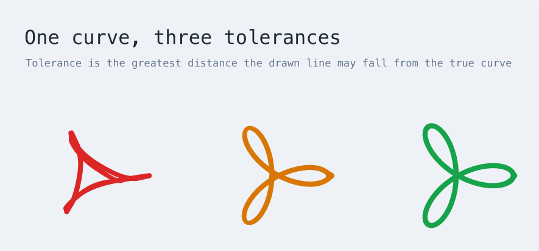
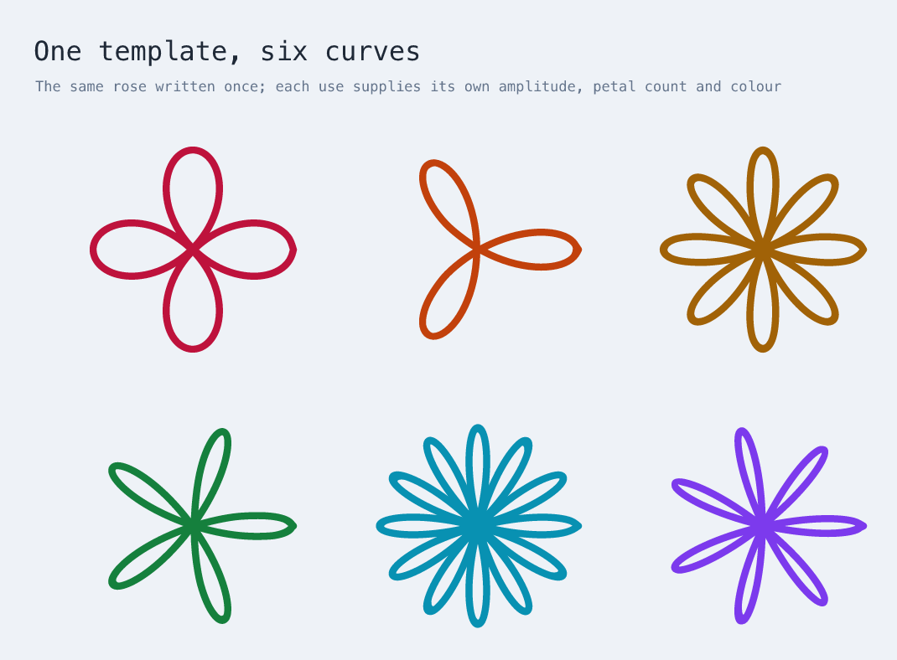

# Plotting curves

`math.plot` draws a parametric curve from a pair of expressions in `t`. The
result is an ordinary freehand stroke: movable, resizable, and editable point by
point like anything else on the canvas.

```xdraw
use "xdraw/math" as math

diagram "Plot" {
  mark: math.plot {
    at (200, 200)
    x = 120 * sin(2*t)
    y = 110 * sin(3*t)
    domain (0, tau)
    stroke "#4d7c0f"
  }
}
```

## What it can draw

A wider gallery, with the measured limits, is in
[A gallery, and where it breaks](curve-gallery.md).


Nothing above is a special case in the compiler. Each is the same constructor
with different expressions:

```
butterfly     x = 40·sin(t)·(e^cos(t) − 2·cos(4t) − sin(t/12)^5)
              y = 40·cos(t)·(…)                     over 0 … 12π

harmonograph  x = 115·sin(3t)·e^(−t/60)
              y = 115·sin(2t + 1)·e^(−t/60)         over 0 … 22

wave          x = 12t
              y = 70·sin(t)·e^(−t/14)               over 0 … 40
```

The full source is in
[`examples/parametric-plots.xdraw`](../examples/parametric-plots.xdraw).

## The vocabulary

Expressions are a closed sublanguage, not general-purpose code. There is no
assignment, no control flow, no property access, and one variable.

| | |
|---|---|
| variable | `t` |
| operators | `+` `-` `*` `/` `^`, and parentheses |
| constants | `pi`, `tau`, `e` |
| functions | `sin` `cos` `tan` `asin` `acos` `atan` `atan2` `sqrt` `abs` `sign` `floor` `ceil` `round` `min` `max` `exp` `log` `hypot` |

`^` is right-associative and binds tighter than unary minus, so `-2^2` is `-4`
and `2^3^2` is `512`, as they read on paper.

An expression is written after `=`, not in quotes, because it is an equation
rather than a string. It ends where the grammar says it ends: after a complete
term only an operator can continue it, so the next property name or closing
brace finishes it. Nothing has to be delimited, and a line break means no more
than a space does anywhere else in the language.

Anything outside the vocabulary is rejected when the document is read, with the
position of the problem:

```
x = t = 4        expected a statement at 4:35
x = sin(t        expected ')' at 4:32
x = t ? 1 : 2    unexpected character "?" at 4:35
x = wobble(t)    unknown function 'wobble'
x = a * t        unknown name 'a'
```

## Tolerance is a guarantee, not a target

`tolerance` is the greatest distance a sampled point may fall from the true
curve, in pixels. It defaults to `0.5`.



The same three-petal rose, drawn three times. At a 16px tolerance the petals
collapse into a scrawl; at 0.5px they are full. The compiler spends points where
the curve bends and none where it does not: 21 points, then 65, then 129.

The word *guarantee* is meant literally. The compiler does not sample the curve
at some points and hope the rest behaves; it bounds each span of the curve and
subdivides until the bound fits inside the tolerance. A curve of high frequency
cannot slip between the samples, because there are no samples to slip between.

## The tolerance is about the points, not the ink

A plot becomes a freehand stroke, and both this compiler's preview and
Excalidraw draw such a stroke with [perfect-freehand](https://github.com/steveruizok/perfect-freehand),
which streamlines and smooths the points on its way to an outline. That is
right for a stroke someone drew with a pointer and wrong for one a compiler
computed: measured against the four curves in `examples/parametric-plots.xdraw`,
the smoothing moves the drawn centreline up to 1.8px away from the sampled
polyline, on curves sampled to 0.5px.

So the guarantee below is about where the points are, which is what the sampler
controls. Getting the ink to match would mean emitting a line element rather
than a stroke.

The renderer also scales a stroke by 4.25, mirroring Excalidraw, so
`stroke-width 2` is drawn about eight pixels wide. Fine curves want a fraction:
the plots in this repository use `stroke-width 0.5`, without which strands
overlapping at a few pixels' distance merge into a solid block.

## What it refuses, and why

A curve the compiler cannot draw within its tolerance is refused while the
document is being read, alongside every other language error. It is never
approximated and never silently wrong.

```
x = 1 / t,  0 … 3
  the curve is not finite at t = 0

x = tan(t),  0 … 4
  the curve is unbounded between t = 1.500 and t = 2.000

x = sqrt(abs(t)) / cos(2*t),  0 … 2
  the curve is unbounded between t = 0.7500 and t = 1.000

x = exp(t),  0 … 19
  the curve reaches 1.544e+6 between t = 11.88 and t = 14.25,
  beyond the limit of 1000000

x = wobble(t)          unknown function 'wobble'
x = a * t              unknown name 'a'
x = sin(t, t)          sin takes 1 argument, received 2
```

The third is the interesting one. Both `sqrt(abs(t))` and `cos(2t)` are
perfectly well behaved; dividing one by the other introduces a pole that neither
has on its own. Nothing about the shape of the expression gives it away, and
sampling near it is a matter of luck. The compiler finds it because dividing by
a range that contains zero produces an unbounded range: the pole is a
consequence of the arithmetic rather than something to be detected.

## Composing with the rest of the language

A plot is a stroke, so it sits alongside anything else in a document:

```xdraw
use "xdraw/math" as math

diagram "Composition" {
  flow: frame "A plot is an ordinary stroke once compiled" {
    arrange row { gap 60 }
    input: rectangle "Expression"
    output: rectangle "Editable stroke"
    input -> output "sampled"
  }

  curve: math.plot {
    at (330, 420)
    x = 90 * sin(2*t)
    y = 70 * sin(3*t)
    domain (0, tau)
    stroke "#7c3aed"
  }
}
```

Plots are placed with `at` rather than by layout, because a curve's position is
part of what the expressions mean. Everything else in the document arranges
normally around them.

## Curves from a template

A plot is described when the document is read and drawn afterwards, so a
template may supply values to its equations:

```xdraw
use "xdraw/math" as math

diagram "One template, six curves" {
  let unit = 120

  rose: template(x0, y0, amp, freq, hue) {
    curve: math.plot {
      at = (${x0}, ${y0})
      x = ${amp} * cos(${freq} * t) * cos(t)
      y = ${amp} * cos(${freq} * t) * sin(t)
      domain (0, tau)
      stroke "${hue}"
    }
  }

  a: rose (260, 300, unit, 2, "#be123c")
  b: rose (600, 300, unit, 3, "#c2410c")
  c: rose (940, 300, unit, 4, "#a16207")
}
```



A named value may be passed as an argument, as `unit` is above. A parameter that
no template supplies is reported rather than reaching the sampler:

```
plot 'mark' could not be drawn: '${amp}' is not supplied by any template
```

## Limits worth knowing

- **A `domain` end is a number, a constant, or an expression.** `(0, 6 * tau)`
  works, as does one naming a `let` binding.
- **A closed curve shows a faint seam** where its start and end meet, because
  the stroke has ends even when the curve does not.
- **Fidelity is bounded on the emitted points, not on the rendered stroke.**
  Excalidraw smooths freehand strokes when drawing them, which generally flatters
  a coarse curve rather than harming it.
- **A curve that crosses the negative x axis through `atan2`** has a genuine
  jump there, and the stroke will cross the gap with a straight segment.
- **Expressions are bounded in size**, at most 512 terms and 64 levels of
  nesting: so a generated document cannot exhaust the compiler.

## Where it lives

`math.plot` is declared in the `xdraw/math` library alongside `math.formula`.
The expression sublanguage is
[`src/language/expression.ts`](../src/language/expression.ts), the bounding
arithmetic is [`src/language/interval.ts`](../src/language/interval.ts), and the
sampler that turns a curve into points is
[`src/language/curve-sampler.ts`](../src/language/curve-sampler.ts). See
[the architecture notes](architecture.md) for how those fit together.
