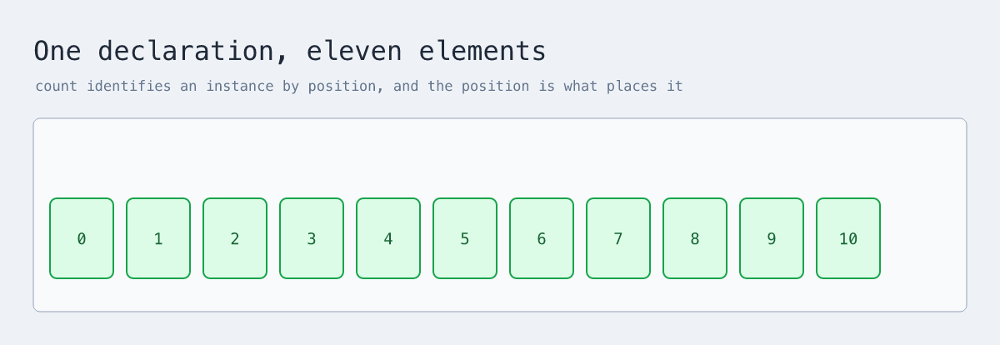

# A tour of XDraw

XDraw turns concise source into editable Excalidraw scenes. This is the guide:
it starts with a declaration and ends with a hosted scene, and every example
compiles. The [specification](spec.md) defines the grammar, the property types,
and the limits; where the two disagree, the specification is right.

## Contents

- [Declaring elements](#declaring-elements)
- [Content and style](#content-and-style)
- [Arranging](#arranging)
- [Connecting and addressing](#connecting-and-addressing)
- [Named values](#named-values)
- [One declaration, many elements](#one-declaration-many-elements)
- [Placing from measured geometry](#placing-from-measured-geometry)
- [Reusing a pattern](#reusing-a-pattern)
- [Semantic libraries](#semantic-libraries)
- [Formulas](#formulas)
- [Plotting curves](#plotting-curves)
- [What curves reach, and where they stop](#what-curves-reach-and-where-they-stop)
- [Text, code, and images](#text-code-and-images)
- [Refining geometry](#refining-geometry)
- [Hosted scenes](#hosted-scenes)
- [Checking and building](#checking-and-building)

## Declaring elements

Every local document contains one named diagram:

```xdraw
diagram "Release flow" {
  plan: rectangle "Plan"
  ship: ellipse "Released"
  plan -> ship "approve"
}
```

Each declaration has a stable ID, a constructor, and usually a visible title:

```text
id: constructor "Title" { properties and children }
```

The core constructors are `rectangle`, `ellipse`, `diamond`, `frame`, `section`,
`group`, `text`, `code`, `freedraw`, `asset`, and `image`. The definitions used
for reuse are `template`, `style`, and `theme`.

Comments begin with `#`. Newlines and semicolons are both optional separators,
so use whichever reads better.

## Content and style

Properties live inside an element block:

```xdraw
use "xdraw/palette" as palette

diagram "Styled cards" {
  default: theme { font-family normal }
  emphasis: style {
    stroke "#0f766e"
    background "#ccfbf1"
  }

  request: rectangle "Request" {
    body "Ready for review"
    style emphasis
    size (260, 120)
    align left
    vertical-align top
  }
  approved: rectangle "Approved" { style palette.success }
  request -> approved
}
```

A theme supplies document defaults, a named style overrides the theme, and a
property on an element overrides both. The palette tones are `neutral`, `info`,
`success`, `warning`, `danger`, and `accent`.

`at (x, y)` places an element explicitly and `size (width, height)` sizes it
explicitly. Most diagrams need neither, because XDraw measures its content and
arranges it.

## Arranging

At diagram scope the layouts are `compact`, `grid`, and `layered`:

```xdraw
diagram "Service flow" {
  arrange layered { spacing airy }
  client: rectangle "Client"
  api: rectangle "API"
  store: ellipse "Store"
  client -> api
  api -> store
}
```

Inside a frame, group, section, or lane, they are `row` and `column`:

```xdraw
diagram "Grouped work" {
  delivery: frame "Delivery" {
    arrange row { gap 56 }
    build: rectangle "Build"
    verify: rectangle "Verify"
    build -> verify
  }
}
```

The three containers differ in what they are for. `group` is an invisible layout
and selection boundary, `section` is a visible panel, and `frame` is a native
Excalidraw frame whose children move with it.

A strict hierarchy comes from `tree`, which derives its shape from the arrows
between the container's own children:

```xdraw
diagram "Outcomes" {
  outcomes: frame "Outcomes" {
    arrange tree { root result; direction right }
    result: rectangle "Result"
    accepted: rectangle "Accepted"
    rejected: rectangle "Rejected"
    result -> accepted
    result -> rejected
  }
}
```

Tree nodes must be direct children, reachable from the root, acyclic, and
limited to one parent each.

## Connecting and addressing

`->` draws an arrow and `--` draws a line. Anchors are worth adding when the
attachment side matters:

```xdraw
diagram "Request path" {
  arrange grid { columns 2; gap 90 }

  source: frame "Source" { api: rectangle "API" }
  target: frame "Target" { worker: rectangle "Worker" }

  request: source.api@right -> target.worker@left "submit" {
    route elbow
    stroke-style dashed
    head triangle
  }
}
```

Nested declarations produce qualified IDs such as `source.api`, and inside a
container a local name resolves before an outer one. The anchors are `top`,
`right`, `bottom`, `left`, and `center`.

A written anchor attaches at that side's midpoint. When both ends of a
`straight` or `line` connection omit their anchor, each end attaches where the
segment between the two centres crosses the border, so several connectors
leaving one element in different directions do not pile onto the same point.

The routes are `auto`, `straight`, `elbow`, `curved`, and `line`. Use
`via ((x, y), (x, y))` when a connector needs explicit waypoints.

## Named values

A document may name a number and reuse it:

```xdraw
use "xdraw/math" as math

diagram "One number, named once" {
  let unit = 56
  let card = unit * 5
  let radius = unit * 2.4

  first: rectangle "Ingest" { at (100, 220); size = (card, unit * 1.6) }

  rose: math.plot {
    at (720, 400)
    x = radius * cos(5 * t) * cos(t)
    y = radius * cos(5 * t) * sin(t)
    domain (0, tau)
  }
}
```


Change `unit` and the cards, the gaps, and the flower all move together. Full
source in [`examples/named-values.xdraw`](../examples/named-values.xdraw).

The reason this exists is dull and convincing: the most duplicated construct in
this repository's own diagrams was a number. One file repeated `size (390, 96)`
eight times and another repeated `size (255, 92)` six times, and there was no
way to say it once.

A binding may contain anything the [expression
sublanguage](#the-expression-sublanguage) accepts, plus any name bound earlier
or later in the same document. Bindings resolve by **what they depend on, not by
where they appear**, so a document may read in whatever order suits it:

```xdraw
diagram "" {
  let gap = card / 4
  let card = 260
  a: rectangle "A" { at (0, 0); stroke-width = gap / 32 }
}
```

A bound name may be used anywhere a number is written, after an `=`:

```
stroke-width = base            a single number
size = (card, card / 2)        a pair
x = radius * cos(t)            an expression that keeps its own variable
```

The last one matters. A plotted curve's `t` is bound by the sampler rather than
by the document, so `radius` is folded in and `t` is left for whoever binds it.

What gets rejected, and how it reads:

```
let a = b + 1        'a' depends on itself: a -> b -> a
let b = a + 1

let a = a + 1        'a' depends on itself: a -> a
let a = mystery * 2  unknown name 'mystery', used by 'a'
let a = 1            'a' is bound more than once
let a = 2
let a = 1 / 0        'a' is not a finite number
let tau = 5          'tau' is a constant of the expression language and cannot be bound
let sin = 5          'sin' is a function of the expression language and cannot be bound
```

A cycle reports the path that closes it rather than looping, and an unbound name
reports who used it rather than defaulting to zero.

An expression has no closing delimiter, which is the one rough edge here. It
ends where the grammar ends it, so an unfinished one runs into the statement
after it:

```text
diagram "" {
  let a = 1 +
  x: rectangle "X" { at (0, 0) }
}
```

`1 +` continues onto the next line and takes `x` as its right operand. The
document is still rejected, but the complaint lands on the statement that got
eaten, `expected a statement`, rather than on the expression that was left
unfinished. That is the cost of not delimiting expressions, and a test pins it
so it cannot quietly get worse.

## One declaration, many elements

A declaration may repeat. `each` names its instances by item; `count` names them
by position.

```xdraw
use "xdraw/palette" as palette

diagram "Ring" {
  let cx = 560
  let cy = 500
  let wide = 400
  let tall = 280

  gateway: ellipse "gateway" {
    at = (cx - 70, cy - 45)
    size (140, 90)
    style palette.accent
  }

  spoke: ellipse "${each}" {
    each ("auth", "billing", "search", "audit", "email", "queue", "cache", "report", "admin")
    at = (cx - 60 + wide * cos(tau * spoke.index / spoke.count), cy - 36 + tall * sin(tau * spoke.index / spoke.count))
    size (120, 72)
    style palette.info
  }
}
```


That is not writable by hand at any length, because each element's position
depends on which instance it is. Full source, including the connectors that
address the instances by name, in
[`examples/repetition.xdraw`](../examples/repetition.xdraw).

### `each` names by item, `count` names by position

```
each ("Ingest", "Parse")   ->   stage.Ingest, stage.Parse
count 3                    ->   spoke.0, spoke.1, spoke.2
```

That difference is the reason both exist. A key describes identity and an index
describes position, so **inserting an item into an `each` leaves every other
instance named exactly as it was**:

```
each ("a", "c")        ->   s.a, s.c
each ("a", "b", "c")   ->   s.a, s.b, s.c        a and c keep their names
```

Inserting into a `count` renumbers everything after the insertion, and an edit
made in Excalidraw against `spoke.3` now belongs to a different element.
Terraform learned this the hard way with `count` and `for_each`; prefer `each`
whenever the instances have names worth using.

### What each instance knows

| | |
|---|---|
| `${each}` | the item, in a title or any other string |
| `name.index` | which instance this is, from 0 |
| `name.count` | how many there are |

Each of those reaches a string as well, wrapped in `${...}`, so a repeat can
label its own instances:

```xdraw
diagram "" {
  step: text "${index} of ${count}" {
    count 4
    at = (120 + 150 * step.index, 200)
  }
}
```

`${step.index}` and `${each.index}` are the same value written differently. A
`${...}` name no repeat supplies is left alone, since a template parameter looks
the same and is bound later.

`index` and `count` are what make repetition worth having, because they reach
expressions:

```xdraw
diagram "" {
  tick: rectangle "·" {
    count 11
    at = (90 + 92 * tick.index, 300 - 14 * tick.index)
    size (76, 130)
  }
}
```



`each.index` and `each.count` work too, when the declaration's own name is
awkward to repeat.

A repeated declaration nests. Its instances are named under their container,
`panel.cell.0`, and children expand before their parent, so an inner repeat's
index is resolved before the outer one folds anything.

What gets rejected:

```
's' uses both each and count; a declaration repeats one way or the other
's' each needs at least one item, written as ("a", "b")
's' each has a duplicate item 'a'
's' each item "two words" cannot be used as a name
's' count must be a whole number of at least 1
's' count is 100000, beyond the limit of 512
```

Two instances cannot share a name, so a duplicate item is refused rather than
silently collapsing into one element. The instance limit exists because a
repeated declaration is cheap to write and expensive to draw.

Repetition runs in [`src/language/repetition.ts`](../src/language/repetition.ts),
before templates expand, so a repeated declaration may use a template and the
instances are ordinary declarations by the time anything else sees them.

## Placing from measured geometry

An expression may name another element's geometry:

```xdraw
use "xdraw/palette" as palette

diagram "Measured" {
  flow: frame "Laid out automatically" {
    arrange row { gap 90 }
    ingest: rectangle "Ingest" { style palette.info }
    emit: rectangle "Emit" { style palette.success }
  }

  label: text "beside the last box" {
    at = (flow.emit.right + 24, flow.emit.center_y)
  }
}
```


Every tick above sits on a box the compiler measured and the layout placed. None
of those numbers appears in the source, and none could be written down: they
depend on the text inside each box and the gap the layout chose. Full source in
[`examples/measured-annotations.xdraw`](../examples/measured-annotations.xdraw).

### The parts of a box

| | |
|---|---|
| edges | `left` `right` `top` `bottom` |
| size | `width` `height` |
| centre | `center_x` `center_y` |

A reference is written `element.part`, and a nested element keeps its qualified
name: `flow.ingest.right`. The parts are a closed set and none contains a dot,
so the last segment is always the part, which is what makes `flow.ingest.right`
unambiguous even though `flow.ingest` is itself a name.

References compose with arithmetic and with `let`:

```xdraw
diagram "" {
  let margin = 40
  flow: frame "F" {
    arrange row { gap 70 }
    a: rectangle "A"
    b: rectangle "B"
  }
  note: text "note" { at = (flow.b.right + margin, flow.a.top - margin) }
}
```

### What may refer, and what may be referred to

Text and freehand may refer. They are drawn where they are told and take no part
in layout.

A node may not, and says so rather than failing later:

```
node 'tag' at could not be resolved to numbers: 'flow.a.right + 20'.
A name must be bound with 'let'; only text and freehand may be placed from
another element's geometry
```

A node placed with `at` participates in document layout: the document grows to
contain it and everything else shifts, so resolving its position against a box
it had already displaced would need resolving again. The dependency would be
between placement and layout rather than between two names, which no amount of
cycle detection can see. Measured: adding one absolutely placed rectangle moved
the frame it would have referenced from y=118 to y=731.

Only laid-out elements may be referred to. Nodes, frames, sections, and
groups have boxes. Text and freehand do not, because the layout never placed
them, so they are not addressable:

```
text 'b': no element 'a' to take 'right' from
```

That also disposes of mutual reference: two elements pointing at each other
cannot both be detached and both be measurable.

### A point along a curve

`along_x(curve, u)` and `along_y(curve, u)` give a point on a drawn stroke.
`u = 0` is its start and `u = 1` its end.

```xdraw
use "xdraw/math" as math

diagram "Markers" {
  spiral: math.plot {
    at (620, 340)
    x = 13 * t * cos(t)
    y = 13 * t * sin(t)
    domain (0, 20)
    stroke "#0891b2"
  }
  half: text "halfway" {
    at = (along_x(spiral, 0.5) + 14, along_y(spiral, 0.5))
  }
}
```


The fraction is **arc length, not parameter**. Halfway along a spiral is halfway
along the line you can see, not halfway through the range of `t`, which is why
the markers above crowd near the centre where the same length of line covers
much less ground. A fraction outside 0…1 is clamped to the ends.

Only strokes can be walked, since only they have points:

```
along expects a stroke, and 'box' is not one
along_x takes a stroke and a fraction from 0 to 1
```

An unresolvable reference is a diagnostic naming what was missing, never a
silent zero:

```
no element 'mystery' to take 'right' from      the element does not exist
unknown name 'flow.ingest.middle'              'middle' is not a part of a box
```

This runs after layout, in
[`src/compile/geometry-references.ts`](../src/compile/geometry-references.ts). A
`let` binding is a constant and is folded while the document is read; these
numbers do not exist until measurement and layout have produced them, so they
get their own pass over the boxes the compiler actually placed.

## Reusing a pattern

A document-scoped template expands into isolated, addressable elements:

```xdraw
use "xdraw/architecture" as arch
use "xdraw/palette" as palette

diagram "Services" {
  arrange grid { columns 1; gap 40 }

  service: template(name, visual_style) {
    unit: section "${name}" {
      arrange row { gap 185 }

      api: arch.container "${name} API" {
        description "Serves ${name} over HTTP"
        technology "Go"
        style $visual_style
      }
      data: arch.database "${name} data" {
        description "Stores ${name} records"
        technology "Postgres"
      }
      api -> data "reads and writes" { technology "SQL" }
    }
  }

  orders: service("Orders", palette.info)
  billing: service("Billing", palette.warning)
}
```

Arguments bind by position. `$name` supplies a complete property value and
`${name}` interpolates into a string, including into the section's own title.
Instance IDs are qualified, so the elements above are `orders.unit.api`,
`billing.unit.api`, and so on.

A template may hold a container, which is what keeps each instance together on
the page rather than letting the document layout mix them.

## Semantic libraries

Standard-library constructors make intent visible while still producing ordinary
editable Excalidraw elements:

```xdraw
use "xdraw/architecture" as arch

diagram "Order context" {
  customer: arch.person "Customer" {
    description "Places and tracks orders"
  }
  platform: arch.system "Order platform" {
    description "Coordinates order processing"
  }
  customer -> platform "places order" { technology "HTTPS" }
}
```

| Import | Exports |
|---|---|
| `xdraw/architecture` | `person`, `system`, `external-system`, `container`, `component`, `database`, `queue`, `system-boundary`, `container-boundary`, `deployment-node`, `group` |
| `xdraw/process` | `lane` |
| `xdraw/sequence` | `sequence`, `participant` |
| `xdraw/table` | `table`, `header`, `row` |
| `xdraw/math` | `formula`, `plot` |
| `xdraw/annotations` | `note`, `callout` |
| `xdraw/connectors` | `junction` |
| `xdraw/assets` | `icon` |
| `xdraw/palette` | `neutral`, `info`, `success`, `warning`, `danger`, `accent` |

Imports require an alias, and a qualified name such as `arch.system` is the only
way to reach a library constructor: importing never adds unqualified names.

The compiler validates every document against these manifests and reports the
offending constructor or property with its source location. Tools that need the
manifests programmatically can import `listLibraryManifests` and
`getLibraryManifest` from the package.

A table calculates its column widths from its content and wraps cells when space
is constrained. The generated cells stay editable Excalidraw rectangles and
text:

```xdraw
use "xdraw/table" as table

diagram "Orders" {
  orders: table.table "Orders" {
    table.header "Order" "Customer" "Total"
    table.row "1001" "A. Ndlovu" "R450"
    table.row "1002" "K. Singh" "R980"
  }
}
```

`table.header` and `table.row` are anonymous child constructors, so they need no
`id:` prefix. A table requires exactly one header and at least one row, and
every row must have as many cells as the header.

A sequence uses `seq.sequence` as its container and needs at least two
participants:

```xdraw
use "xdraw/sequence" as seq

diagram "Request" {
  interaction: seq.sequence {
    client: seq.participant "Client"
    server: seq.participant "Server"
    client -> server "request"
    server -> client "response"
  }
}
```

## Formulas

Formulas accept raw triple-quoted TeX and compile to deterministic embedded SVG.
The result is a movable, resizable image that keeps its authored TeX and
renderer version attached for inspection:

```xdraw
use "xdraw/math" as math

diagram "Formula" {
  gaussian: math.formula """
    \int_0^\infty e^{-x^2}\,dx = \frac{\sqrt{\pi}}{2}
  """
}
```

Use triple quotes for every formula so backslashes stay literal. Common
indentation is ignored when rendering. The supported TeX packages are `base` and
`ams`, and commands that would load remote or executable content are rejected.
Formula count, source length, output size, and image dimensions are all bounded.
A programmatic consumer must use `compileAsync()` for a document containing
`math.formula`; the CLI selects it automatically.

## Plotting curves

`math.plot` draws a parametric curve from a pair of expressions in `t`. The
result is an ordinary freehand stroke: movable, resizable, and editable point by
point like anything else on the canvas.

```xdraw
use "xdraw/math" as math

diagram "Plot" {
  mark: math.plot {
    at (200, 200)
    x = 120 * sin(2*t)
    y = 110 * sin(3*t)
    domain (0, tau)
    stroke "#4d7c0f"
  }
}
```


Nothing above is a special case in the compiler. Each is the same constructor
with different expressions, and the source is in
[`examples/parametric-plots.xdraw`](../examples/parametric-plots.xdraw).

Plots are placed with `at` rather than by layout, because a curve's position is
part of what its expressions mean. Everything else in the document arranges
around them.

### The expression sublanguage

Expressions are a closed sublanguage, not general-purpose code. There is no
assignment, no control flow, no property access, and one variable.

| | |
|---|---|
| variable | `t` |
| operators | `+` `-` `*` `/` `^`, and parentheses |
| constants | `pi`, `tau`, `e` |
| functions | `sin` `cos` `tan` `asin` `acos` `atan` `atan2` `sqrt` `abs` `sign` `floor` `ceil` `round` `min` `max` `exp` `log` `hypot` |

`^` is right-associative and binds tighter than unary minus, so `-2^2` is `-4`
and `2^3^2` is `512`, as they read on paper.

An expression is written after `=` rather than in quotes, because it is an
equation and not a string. It ends where the grammar says it ends: after a
complete term only an operator can continue it, so the next property name or
closing brace finishes it. Nothing has to be delimited, and a line break means
no more than a space does anywhere else in the language.

Anything outside the vocabulary is rejected when the document is read, with the
position of the problem:

```
x = t = 4        expected a statement at 4:35
x = sin(t        expected ')' at 4:32
x = t ? 1 : 2    unexpected character "?" at 4:35
x = wobble(t)    unknown function 'wobble'
x = a * t        unknown name 'a'
```

Expressions are bounded in size, at most 512 terms and 64 levels of nesting, so
a generated document cannot exhaust the compiler.

### Tolerance is a guarantee, not a target

`tolerance` is the greatest distance a sampled point may fall from the true
curve, in pixels. It defaults to `0.5`.


The same three-petal rose, drawn three times. At a 16px tolerance the petals
collapse into a scrawl; at 0.5px they are full. The compiler spends points where
the curve bends and none where it does not: 21 points, then 65, then 129.

The word *guarantee* is meant literally. The compiler does not sample the curve
at some points and hope the rest behaves; it bounds each span of the curve and
subdivides until the bound fits inside the tolerance. A curve of high frequency
cannot slip between the samples, because there are no samples to slip between.

### The tolerance is about the points, not the ink

A plot becomes a freehand stroke, and both this compiler's preview and
Excalidraw draw such a stroke with
[perfect-freehand](https://github.com/steveruizok/perfect-freehand), which
streamlines and smooths the points on its way to an outline. That is right for a
stroke someone drew with a pointer and wrong for one a compiler computed:
measured against the four curves in `examples/parametric-plots.xdraw`, the
smoothing moves the drawn centreline up to 1.8px away from the sampled polyline,
on curves sampled to 0.5px.

So the guarantee above is about where the points are, which is what the sampler
controls. Getting the ink to match would mean emitting a line element rather
than a stroke.

The renderer also scales a stroke by 4.25, mirroring Excalidraw, so
`stroke-width 2` is drawn about eight pixels wide. Fine curves want a fraction:
the plots in this repository use `stroke-width 0.5`, without which strands
overlapping at a few pixels' distance merge into a solid block.

### What it refuses, and why

A curve the compiler cannot draw within its tolerance is refused while the
document is being read, alongside every other language error. It is never
approximated and never silently wrong.

```
x = 1 / t,  0 … 3
  the curve is not finite at t = 0

x = tan(t),  0 … 4
  the curve is unbounded between t = 1.500 and t = 2.000

x = sqrt(abs(t)) / cos(2*t),  0 … 2
  the curve is unbounded between t = 0.7500 and t = 1.000

x = exp(t),  0 … 19
  the curve reaches 1.544e+6 between t = 11.88 and t = 14.25,
  beyond the limit of 1000000

x = sin(t, t)          sin takes 1 argument, received 2
```

The third is the interesting one. Both `sqrt(abs(t))` and `cos(2t)` are
perfectly well behaved; dividing one by the other introduces a pole that neither
has on its own. Nothing about the shape of the expression gives it away, and
sampling near it is a matter of luck. The compiler finds it because dividing by
a range that contains zero produces an unbounded range: the pole is a
consequence of the arithmetic rather than something to be detected.

### Giving a curve a reference frame

There is no `axes` construct. A frame is built from the pieces already described:
a stroke for each axis, a repeated stroke for the ticks, and a repeated text for
the labels, each placed from its own index.


```xdraw
diagram "Axes" {
  let x0 = 200
  let y0 = 500
  let unit = 88

  xaxis: freedraw { at = (x0, y0); points ((-26, 0), (566, 0)); stroke-width 0.4 }

  xtick: freedraw {
    count 6
    at = (x0 + unit * xtick.index, y0)
    points ((0, 0), (0, 8))
    stroke-width 0.4
  }
  xlabel: text "${index}" {
    count 6
    at = (x0 + unit * xlabel.index - 4, y0 + 18)
    font-size 15
  }
}
```

Because the frame is arithmetic over `unit`, changing that one binding rescales
the whole figure. Full source, with both axes and two curves, in
[`examples/labelled-axes.xdraw`](../examples/labelled-axes.xdraw).

Two limits are worth knowing before building one. A label can show its index but
not a value computed from it, so ticks read `0` to `5` rather than `-3` to `3` or
`pi/4`; interpolating an expression into a string is not yet possible. And a
`background` fills a curve only when the stroke closes, within 8 units, so the
region under an open curve cannot be shaded.

### Curves from a template

A plot is described when the document is read and drawn afterwards, so a
template may supply values to its equations:

```xdraw
use "xdraw/math" as math

diagram "One template, six curves" {
  let unit = 120

  rose: template(x0, y0, amp, freq, hue) {
    curve: math.plot {
      at = (${x0}, ${y0})
      x = ${amp} * cos(${freq} * t) * cos(t)
      y = ${amp} * cos(${freq} * t) * sin(t)
      domain (0, tau)
      stroke "${hue}"
    }
  }

  a: rose (260, 300, unit, 2, "#be123c")
  b: rose (600, 300, unit, 3, "#c2410c")
  c: rose (940, 300, unit, 4, "#a16207")
}
```


A named value may be passed as an argument, as `unit` is above. A parameter that
no template supplies is reported rather than reaching the sampler:

```
plot 'mark' could not be drawn: '${amp}' is not supplied by any template
```

## What curves reach, and where they stop

Everything in this section is `math.plot` with different equations, and every
figure was produced by compiling a file in [`examples/`](../examples/).

### Classical curves


```
cardioid      x = 80·(1 − cos t)·cos t
astroid       x = 120·cos³t                       y = 120·sin³t
nephroid      x = 32·(3cos t − cos 3t)            y = 32·(3sin t − sin 3t)
deltoid       x = 45·(2cos t + cos 2t)            y = 45·(2sin t − sin 2t)
heart         x = 128·sin³t                       y = −8·(13cos t − 5cos 2t − 2cos 3t − cos 4t)
superformula  r = (|cos(3t/4)|⁸ + |sin(3t/4)|⁸)^(−1/8),  x = 110·r·cos t
```

The superformula is the one that stretches the vocabulary: it needs `abs`, a
fractional power, and a negative exponent, and it works because all three are in
the closed function set:

```xdraw
use "xdraw/math" as math

diagram "Superformula" {
  shape: math.plot {
    at (200, 200)
    x = 110 * ((abs(cos(3*t/4))) ^ 8 + (abs(sin(3*t/4))) ^ 8) ^ -0.125 * cos(t)
    y = 110 * ((abs(cos(3*t/4))) ^ 8 + (abs(sin(3*t/4))) ^ 8) ^ -0.125 * sin(t)
    domain (0, tau)
    stroke "#16a34a"
  }
}
```

### A curve with no tangent anywhere


A [Weierstrass function](https://mathworld.wolfram.com/WeierstrassFunction.html)
is continuous everywhere and differentiable nowhere, the classic counterexample
to the intuition that a continuous curve must have a tangent almost everywhere.
Truncating the sum at *k* terms gives something drawable:

```
y = 70·( cos πt + ½cos 3πt + ¼cos 9πt + … + 2⁻ᵏ⁻¹cos 3ᵏ⁻¹πt )
```

Three rows, at three, six, and nine terms. The self-similarity is the point:
each row is the one above it with finer detail on the same skeleton, and the
ninth term oscillates 6561 times faster than the first.

This is the hardest shape to draw accurately, high frequency riding on low, so
that a sampler judging flatness from a handful of probes will call a span
straight when it is anything but. Nine terms needs 3917 points and 409 ms, and
the sampled points stay within 0.484px of the true curve. Source:
[`examples/fractal-curve.xdraw`](../examples/fractal-curve.xdraw).

### Fractals: what a closed vocabulary cannot reach

Wikipedia's [fractal article](https://en.wikipedia.org/wiki/Fractal) names
sixteen or so fractals. **None of them can be drawn here**, and the reason is
worth stating precisely, because it is neither accuracy nor a budget.

Every one is defined by *doing something repeatedly*: an iterated function
system (Koch snowflake, Cantor set, Sierpinski carpet, Menger sponge, dragon
curve, Peano curve), escape-time iteration on a complex number (Mandelbrot,
Julia, Burning Ship, Lyapunov), or a random process (Lévy flight, Brownian
tree). A plot is a function of one parameter, evaluated once per point. There is
no way to say "repeat this transformation" and no complex arithmetic, so those
constructions are out of reach by shape rather than by degree. No larger budget
or finer tolerance brings them closer.

What *is* reachable is the other family: the ones defined by a convergent
series, which truncate to an ordinary function of `t`.


```
blancmange     y = Σ 2⁻ⁿ · σ(2ⁿt)          σ = distance to the nearest integer
Riemann        y = Σ sin(n²t) / n²
lacunary loop  x + iy = Σ aⁿ · e^(i·bⁿt)   drawn as two real series
```

The lacunary loops are the pretty ones, and they are genuinely self-similar:
each lobe carries a smaller copy of the whole figure. They are also the most
expensive thing here, with the ratio-4 loop taking 2,049 points at a 1px
tolerance.

The blancmange curve is where this gets interesting. It needs *distance from t
to the nearest integer*, and there are two ways to write it:

```
abs(u - round(u))            mentions u twice, cannot be sampled
abs(asin(sin(pi * u))) / pi  mentions u once, 311 points
```

**They agree to the last digit at every value of t**, and the first is refused at
every truncation depth while the second draws in a few hundred points. This is
the dependency problem at its sharpest: interval arithmetic cannot see that two
occurrences of `u` move together, so `u - round(u)` is enclosed as though the
two were independent, and the enclosure never tightens enough to pass. The limit
is on how the function is *written*, not on what it computes. Both spellings and
both outcomes are pinned in `test/curve-sampler.test.ts`.

### Curves in a diagram


A plot is an ordinary stroke, so it sits in a diagram with nodes, styles, and
connections. Here each stage names what it contributes and the curve beneath
shows the result: a carrier, an envelope, their product, and the sum with a
faster harmonic. Source:
[`examples/plot-flow.xdraw`](../examples/plot-flow.xdraw).

### What held

Sixteen curves at a 0.5px tolerance, with the worst departure of the sampled
points measured afterwards by dense probing rather than trusted from the
sampler:

| curve | nodes | points | ms | worst | |
|---|--:|--:|--:|--:|---|
| hypotrochoid (spirograph) | 30 | 239 | 16 | 0.172 | held |
| epitrochoid | 30 | 513 | 21 | 0.162 | held |
| heart | 35 | 109 | 5 | 0.255 | held |
| astroid | 12 | 81 | 2 | 0.209 | held |
| nephroid | 22 | 129 | 4 | 0.217 | held |
| deltoid | 22 | 67 | 2 | 0.144 | held |
| cardioid | 18 | 69 | 2 | 0.356 | held |
| logarithmic spiral | 18 | 125 | 4 | 0.415 | held |
| cycloid | 12 | 65 | 1 | 0.325 | held |
| rose, 13 petals | 22 | 569 | 19 | 0.450 | held |
| superformula | 56 | 75 | 6 | 0.257 | held |
| Weierstrass, 5 terms | 49 | 337 | 21 | 0.441 | held |
| Weierstrass, 7 terms | 67 | 1357 | 110 | 0.431 | held |
| Weierstrass, 9 terms | 85 | 3917 | 409 | 0.484 | held |
| Lissajous 9:8 | 14 | 505 | 10 | 0.427 | held |
| harmonograph, 4 terms | 54 | 1083 | 70 | 0.478 | held |

Not one exceeded its tolerance. The closest was 0.484 of 0.5.

### Where it breaks

Every limit below produces a diagnostic naming what was hit rather than a wrong
curve or a hang.

The point budget runs out at around ten thousand oscillations. A Weierstrass
sum of eleven terms, or `sin(5000·t)` over a unit range, exhausts 5,000 points
before reaching a half-pixel tolerance:

```
sampling exceeded 5000 points before reaching a tolerance of 0.5
```

Raising `maximumPoints` gets further, and thirteen terms draws in 6,213 points
and 896 ms, so the wall is the budget rather than the method. A coarser tolerance
is usually the better answer.

Expressions are capped at 512 terms. A Weierstrass sum of about forty terms
still parses; sixty does not:

```
expression holds more than 512 terms
```

The magnitude limit is a million pixels, which `exp(t)` crosses around t = 14.

The domain itself is unlimited, and accepts any expression once it is written as
an equation: the twelve turns a butterfly curve needs are
`domain = (0, 6 * tau)`. Without the `=` the interval takes plain numbers only,
so `domain (0, 6 * tau)` is a syntax error rather than a slower path.

Two smaller things worth knowing. A closed curve shows a faint seam where its
start and end meet, because the stroke has ends even when the curve does not.
And a curve that crosses the negative x axis through `atan2` has a genuine jump
there, which the stroke crosses with a straight segment.

`math.plot` lives in the `xdraw/math` library alongside `math.formula`. The
expression sublanguage is
[`src/language/expression.ts`](../src/language/expression.ts), the bounding
arithmetic is [`src/language/interval.ts`](../src/language/interval.ts), and the
sampler that turns a curve into points is
[`src/language/curve-sampler.ts`](../src/language/curve-sampler.ts). See the
[architecture notes](architecture.md) for how those fit together.

### Sources

- [Hypotrochoid](https://mathworld.wolfram.com/Hypotrochoid.html) and
  [Epitrochoid](https://mathworld.wolfram.com/Epitrochoid.html), MathWorld
- [Rose curve](https://mathworld.wolfram.com/RoseCurve.html), MathWorld
- [Weierstrass function](https://mathworld.wolfram.com/WeierstrassFunction.html),
  MathWorld
- [Roulettes and spirograph curves](http://www.geom.uiuc.edu/docs/reference/CRC-formulas/node34.html),
  CRC Standard Curves and Surfaces

## Text, code, and images

Triple-quoted strings are useful for multiline code:

```xdraw
diagram "Example source" {
  heading: text "Validation" { font-size 24 }
  sample: code """
    diagram "Hello" {
      message: rectangle "Hello, Excalidraw"
    }
  """ {
    title "XDraw"
    language xdraw
    highlight true
  }
}
```

Code highlighting supports `xdraw`, `typescript`, and `sql`, and line numbers
are on by default.

Images are embedded into the output scene, and paths are relative to the source
file:

```xdraw
diagram "Assets" {
  logo: asset "corpus/assets/xdraw-mark.svg"
  preview: image(logo) {
    at (80, 80)
    size (320, 160)
    fit contain
    alt "Project logo"
  }
}
```

PNG, GIF, JPEG, and safe SVG files are supported. An SVG may not contain
scripts, event handlers, remote references, embedded active content, or CSS
imports.

## Refining geometry

Automatic layout can be followed by explicit geometry operations:

```xdraw
diagram "Aligned" {
  first: rectangle "First"
  second: rectangle "Second"
  third: rectangle "Third"

  align top (first, second, third)
  distribute x (first, second, third)
  match-size (first, second, third) both
  offset (third) by (0, 24)
  snap (first, second, third) to 8
}
```

The alignment modes are `left`, `center-x`, `right`, `top`, `center-y`, and
`bottom`. `match-size` accepts `width`, `height`, or `both`.

A scene has no depth beyond the order its elements are drawn in, which is what
Excalidraw's own front-and-back commands change, so `bring-to-front` and
`send-to-back` do the same:

```xdraw
diagram "Badge on a line" {
  left: rectangle "Left" { at (100, 300); size (140, 90) }
  right: rectangle "Right" { at (500, 300); size (140, 90) }
  left -- right
  badge: text "on the line" { at (300, 330) }
  bring-to-front (badge)
}
```

Without the last line the connector covers the label, because a connector is
drawn after the elements it joins. These two operations accept anything drawn,
text and images included, since they change no position.

## Hosted scenes

XDraw can discover, create, update, and retrieve hosted Excalidraw+ scenes. The
browser remains the place for manual editing and collaboration.

Set the personal API key before using any remote command:

```bash
export EXCALIDRAW_API_KEY="your-api-key"
```

The REST base URL defaults to `https://api.excalidraw.com/api/v1`. Override it
with `EXCALIDRAW_API_URL` or `--api-url` for another endpoint.

### Discovering scenes

```bash
xdraw list
xdraw list Architecture
```

Each result carries a canonical address and a stable scene ID. Names make
commands readable; IDs stay available when names are duplicated. The workspace
segment is `default` because the API key selects the workspace.

```text
ADDRESS                                                     SCENE ID
excalidraw::default::Architecture::System overview          scene-123
```

### Retrieving scenes

`pull` accepts an address from `list` or a raw scene ID. Without `-o` it writes
an editable `.excalidraw` file in the current directory, and the output
extension selects other formats:

```bash
xdraw pull "excalidraw::default::Architecture::System overview"
xdraw pull scene-123 -o system-overview.excalidraw
xdraw pull scene-123 -o system-overview.png
xdraw pull scene-123 -o system-overview.svg
```

PNG and SVG output is rendered locally, and the preview controls apply only to
those formats:

```bash
xdraw pull scene-123 -o component.png --frame component --max-width 1200 --padding 32
xdraw pull scene-123 -o logo.png --background transparent
```

### Scene documents

`xdraw apply` accepts a scene document. Its resource identifies the collection
and scene, and its operation is explicitly `replace` or `patch`:

```xdraw
scene excalidraw::default::architecture::system_overview {
  replace {
    diagram "System overview" {
      source: rectangle "Source"
      target: rectangle "Target"
      source -> target
    }
  }
}
```

Collection and scene segments may be IDs or unambiguous normalized names.

`replace` creates the scene when needed and makes the XDraw source authoritative
for its complete contents. `patch` changes elements by their XDraw IDs, leaving
unrelated elements and manual canvas edits alone:

```xdraw
scene excalidraw::default::architecture::overview {
  patch {
    update api { tone warning; title "API v2" }
    delete legacy
    add {
      review: rectangle "Review" { at (80, 80) }
    }
  }
}
```

After `apply`, XDraw prints both the resource address and the scene ID.

## Checking and building

```bash
xdraw check diagram.xdraw
xdraw build diagram.xdraw
xdraw build diagram.xdraw -o diagram.png
cat diagram.xdraw | xdraw build -o diagram.excalidraw
```

`check` reports more than syntax. It reads the diagram the way a reviewer would
and says what it noticed and where:

```
XD2101: architecture element 'flow.api' should describe its responsibility at 7:5
XD2104: relationships between architecture containers should name their technology or protocol at 10:5
XD2001: layout gap 40 was raised to 98 so connector labels fit at 5:5
XD2006: 'flow.api' and 'flow.store' share a row but differ in height, so their connector will not be level; match-size (flow.api, flow.store) height levels them at 10:5
```

Advisories like these do not stop a build. Errors do, and each one names the line
that caused it.

The [specification](spec.md) has the complete grammar, property types, semantic
constraints, processing model, and implementation limits. The
[architecture notes](architecture.md) describe how the compiler is put together.
